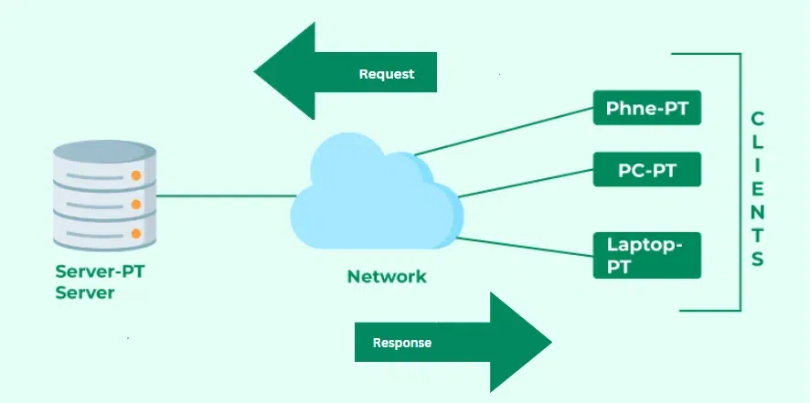
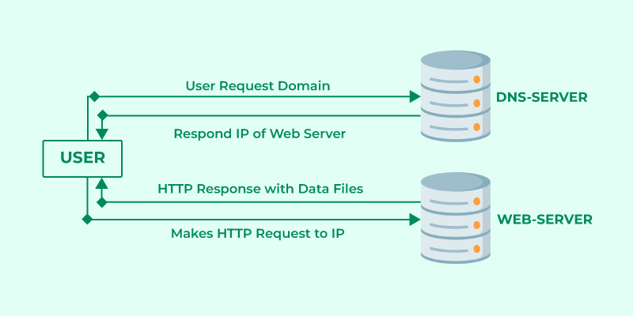

<h2><b>Client-Server Model(SQL)</b></h2>

<h3><b>Introduction</b></h3>

The Client-server model is a distributed application structure that partitions tasks or workloads between the providers of a resource or service, called servers, and service requesters called clients. In the client-server architecture, when the client computer sends a request for data to the server through the internet, the server accepts the requested process and delivers the data packets requested back to the client. Clients do not share any of their resources. Examples of the Client-Server Model are Email, World Wide Web, etc.

<h3><b>Working Principle of Client-Server Model</b></h3>

In this article, we are going to take a dive into the Client-Server model and have a look at how the Internet works via, web browsers. This article will help us have a solid WEB foundation and help us easily work with WEB technologies.
<ul>
<li><b>Client</b>

When we say the word Client, it means to talk of a person or an organization using a particular service. Similarly in the digital world, a Client is a computer (Host) i.e. capable of receiving information or using a particular service from the service providers (Servers).
<li><b>Servers</b>

Similarly, when we talk about the word Servers, It means a person or medium that serves something. Similarly in this digital world, a Server is a remote computer that provides information (data) or access to particular services.</li>
</ul>
So, it is the Client requesting something and the Server serving it as long as it is in the database.

<h3><b>Browser - Server Interaction</b></h3>

There are a few steps to follow to interacts with the servers of a client.

<ul>
<li>User enters the URL(Uniform Resource Locator) of the website or file. The Browser then requests the DNS(DOMAIN NAME SYSTEM) Server.</li>

<li>DNS Server lookup for the address of the WEB Server.</li>

<li>The DNS Server responds with the IP address of the WEB Server.</li>

<li>The Browser sends over an HTTP/HTTPS request to the WEB Server’s IP (provided by the DNS server).</li>

<li>The Server sends over the necessary files for the website.</li>

<li>The Browser then renders the files and the website is displayed. This rendering is done with the help of DOM (Document Object Model) interpreter, CSS interpreter, and JS Engine collectively known as the JIT or (Just in Time) Compilers.</li></ul>

<h3><b>Advantages of Client-Server Model</b></h3>

<ul>
<li>Centralized system with all data in a single place.</li>

<li>Cost efficient requires less maintenance cost and Data recovery is possible.</li>
<li>The capacity of the Client and Servers can be changed separately.</li></ul>

<h3><b>Disadvantages of Client-Server Model</b></h3>

<ul>
<li>Clients are prone to viruses, Trojans, and worms if present in the Server or uploaded into the Server.</li>

<li>Servers are prone to Denial of Service (DOS) attacks.</li>

<li>Data packets may be spoofed or modified during transmission.</li>

<li>Phishing or capturing login credentials or other useful information of the user are common and MITM(Man in the Middle) attacks are common.</li></ul>

<h6>Reference</h6>

https://www.geeksforgeeks.org/client-server-model/
