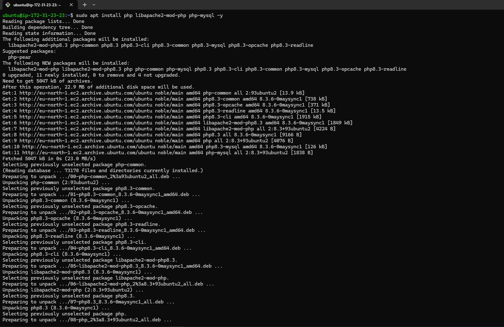

## **LAMP STACK IMPLEMENTATION IN AWS**

### **Introduction**

A LAMP stack is a bundle of four different software technologies that developers use to build websites and web applications. LAMP is an acronym for the operating system, Linux; the web server, Apache; the database server, MySQL; and the programming language, PHP, Perl or Python. All four of these technologies are open source, which means they are community maintained and freely available for anyone to use. Developers use LAMP stacks to create, host, and maintain web content. It is a popular solution that powers many of the websites you commonly use today.

### **Prerequisites**
1. An AWS account with appropriate permissions to create and manage EC2 instances, Security Groups, and Key Pairs.
2. Basic familiarity with AWS services and the Linux command line interface.

### **Step 0 : Set up EC2 Instance**
#### 1. Lunch EC2 instance type of t3.micro and Ubuntu 24.04 LTS (HVM) AMI type in eu-north-1 region.


#### 2. Create ssh key to access the EC2 server for secure access to the EC2 instance.
#### 3. Configure network security group to allow traffic on port 80 for HTTP connection, port 443 for HTTPS connectiona nd port 22 for SSH connection to the EC2 server.


#### 4. Conect to EC2 Instance via SSH
Before connecting to the instance, chnage the permission for the downloaded ssh key  to ensure your key is not publicly viewable with the command below:

```bash
sudo chmod 400 <private-key-name>.pem
```

After chnaging the permission . connect to the instance with the command below:

```bash
ssh -i "<private-key-name>.pem" ubuntu@<ip-address or dns-name>
```


### **Step 1 : Install Apache and Update the Firewall**

#### 1. Update and Upgrade the packages on the EC2 server

```bash
sudo apt update
sudo apt upgrade -y
```

 


#### 2. Install Apache using Ubuntu's package manager "apt"

```bash
sudo apt install apache2 -y
```


#### 3. Enable the apache service and confirm it is running

```bash
sudo systemctl enable apache2
sudo systemctl status apache2
```


#### 4. Check if server is running, can be accessed locally and from internet (source 0.0.0.0/0 means from any IP)

```bash
curl http://localhost:80
curl http://127.0.0.1:80
```


#### 5. Test how the Apache HTTP server respond to requests from internet via a web browser.

```bash
http://<public-ip>:80
```


#### 5. Another way to retrieve the public ip address other than check the aws console.

```bash
curl -s http://169.254.169.254/latest/meta-data/public-ipv4
```
Before runnng the above command, change the IMDSv2 of the instance on aws console following the steps below: 

- Actions > Instance Settings > Modify instance metadata options.
- Then change the IMDSv2 from Required to Optional.


After that run the command 

```bash
curl -s http://169.254.169.254/latest/meta-data/public-ipv4
```


### **Step 2 : Install MySQL**

#### 1. Install MySQL e using Ubuntu's package manager "apt"

```bash
sudo apt install mysql-server -y
```


#### 2. Enable the mysql service and confirm it is running

```bash
sudo systemctl enable mysql
sudo systemctl status mysql
```


#### 3. Log in to MySQL conole

```bash
sudo mysql
```
This will connect to MySQL server as the administrative database root user, which is inferred by the use of sudo when running this command.


#### 4. Set a password for the root user, using mysql_native_password as deafult authentication method.

```bash
ALTER USER 'root'@'localhost' IDENTIFIED WITH mysql_native_password BY 'PassWord.1';
```


#### 5. Run security script to remove some insure default settings and lock down acces to database system. This script comes pre-installed with MySQL. Before running the script, It is important to set a password for the root user which has been done in setp 4. Before running the script exit the MySQL shell

```bash
exit

sudo mysql_secure_installation -y
```


#### 6. Re-login into MySQL console to test the new credentails and exit

```bash
sudo mysql -p
```


### **Step 3 : Install PHP**

#### 1. Install PHP using Ubuntu's package manager "apt"

```bash
sudo apt install php libapache2-mod-php php-mysql
```


#### 2. Comfirm php version

```bash
php -v
```


### **Step 4 : Create a Virtual Host for Website using Apache**
#### 1. Set a domain called projectlamp. Create a directory for projectlamp.

```bash
sudo mkdir /var/www/projectlamp
```
Assign ownership of the directory with the $user environmen variable, which will reference the current system user.

```bash
sudo chown -R $user:$user /var/www/projectlamp
```


#### 2. Create and open a new configuration file in apache's sites-avaialbale directory.

```bash
sudo vi /etc/apache2/sites-available/projectlamp.conf
```


Use ls command to show the new file in the sites-available directory

```bash
sudo ls /etc/apache2/sites-available
```


#### 3. Enable the Virtual Host.
Use a23nsite to enable the new virtual host.

```bash
sudo a2ensite projectlamp
```


#### 4. Disable apache's default website using a2ensite command. 

```bash
sudo a2dissite 000-default
```


#### 5. Ensure the configuration does not contain syntax error

```bash
sudo apache2ctl configtest
```


#### 6. Reload Apache to effect the changes in step 4.

```bash
sudo systemctl reload apache2
```
#### 7. Create an index.html in /var/www/projectlamp to test the virtual host work.

```bash
sudo sh -c "echo 'Hello LAMP from hostname' $(curl -s http://169.254.169.254/latest/meta-data/public-hostname) 'with public IP' $(curl -s http://169.254.169.254/latest/meta-data/public-ipv4) > /var/www/projectlamp/index.html"
```

#### 8. Opne the website in a web browser using the server Ip address

```bash
http://<public-IP-address>:80
```


### **Step 5 : Enable PHP on the website**

With the default DirectoryIndex setting on Apache, index.html file will always take precedence over index.php file. This is useful for setting up maintenance page in PHP applications, by creating a temporary index.html file containing an informative message for visitors. The index.html then becomes the landing page for the application. Once maintenance is over, the index.html is renamed or removed from the document root bringing back the regular application page. If the behaviour needs to be changed, /etc/apache2/mods-enabled/dir.conf file should be edited and the order in which the index.php file is listed within the DirectoryIndex directive should be changed.

#### 1. Edit the /etc/apache2/mods-enabled/dir.conf file and change the order in which the index.php file is listed within the DirectoryIndex directive:

```bash
sudo vim /etc/apache2/mods-enabled/dir.conf
```

```bash
#from --->  
DirectoryIndex index.html index.cgi index.pl index.php index.xhtml index.htm #to --->
DirectoryIndex index.php index.html index.cgi index.pl index.xhtml index.htm
```


#### 2. Relaod the apache service to effect the change

```bash
sudo systemctl reload apache2
```


#### 3. Create a new file named index.php inside the the custome web root folder

```bash
sudo vi /var/www/projectlamp/index.php
```
Add the code below to the index.php file

```php
<?php
phpinfo();
```


#### 4.  Refresh the web page to comfirm the change.


#### 5.  After comfirm the change, delete the index.php as it contains sensitive data about the PHP environment and ubuntu server.

```bash
sudo rm /var/www/projectlamp/index.php
```

