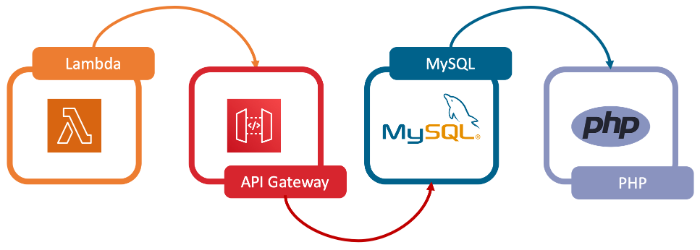

## **Linux Apache MySQL PHP (LAMP) Stack**

### **Introduction**

A LAMP stack is a bundle of four different software technologies that developers use to build websites and web applications. LAMP is an acronym for the operating system, Linux; the web server, Apache; the database server, MySQL; and the programming language, PHP. All four of these technologies are open source, which means they are community maintained and freely available for anyone to use. Developers use LAMP stacks to create, host, and maintain web content. It is a popular solution that powers many of the websites you commonly use today.

A LAMP stack is used for backend or server-side development. A backend application is software that runs in an environment that’s hidden from end users. Backend applications consist of data processing software, datbase components, business logic in code, API for communicating with other applications. The webpage that shows up on your browser is called the frontend application. When you interact with the page, such as by clicking on a button, your browser communicates with the backend application to retrieve the required information. Developers use a LAMP stack to create both static and dynamic web content.

#### 1. **Static Webpages**

Static webpage information from the web server is the same for all users. For example, the address on a company's website is static content. Web developers create static webpages with HTML and CSS programming languages and store them as files in the web server application. 

#### 2. **Static Webpages**
Dynamic webpages contain information that changes depending on the user viewing the webpage or web application. For example, a website message that changes based on your location is dynamic content. The web server delivers dynamic websites by processing business logic or retrieving data from a database.

### **LAMP ARCHITECTURE**

A software stack is a set of layered tools, libraries, programming languages, and technologies used for building, managing, and running an application. The stack consists of software components that support the application in different ways, such as visual presentation, database, networking, and security. 

Similarly, the LAMP architecture consists of four software technologies that work together behind the scenes to create a working web application. It describes how each of these web development technologies interact with each other in a computer server. The LAMP architecture consists of the following layers.

#### 1. **Linux**
Linux is an open-source operating system that you can install and configure to meet different application requirements. Linux sits at the first level of the LAMP stack and supports other components on the upper layers.

#### 2. **Apache**

Apache is an open-source web server that forms the second layer of the LAMP stack. The Apache module stores website files and exchanges information with a browser using HTTP, an internet protocol for transferring website information in plain text. For example, when a browser requests a webpage, the Apache HTTP server recieves the request, processes the request and finds the required page file and sends the relevant information back to the browser.

#### 3. **MySQL**

MySQL is an open-source relational database management system and is the third layer of the LAMP stack. The LAMP model uses MySQL for storing, managing, and querying information in relational databases. For example, developers store application data, such as customer records, sales, and inventories. When a user searches for information, the web server queries the stored data in MySQL. Query refers to special instructions for manipulating data in a relational database with the SQL language.

#### 4. **PHP**

PHP, which stands for PHP: Hypertext Preprocessor, is the fourth and final layer of the LAMP stack. It is a scripting language that allows websites to run dynamic processes. A dynamic process involves information in software that constantly changes. Web developers embed the PHP programming language in HTML to show real-time or updated information on websites. They use PHP to allow the web server, database, and operating system to cohesively process requests from browsers. Web developers use HTML for frontend development, such as designing the layout of webpages. Meanwhile, they use PHP to determine the behavior of certain components when users load a webpage. For example, web developers design the graphical layout of an online product catalog with HTML. They then use PHP code to retrieve the latest product price from the backend server. 

### **LAMP ALTENATIVES**

LAMP alternatives, or LAMP variants, are backend development technologies that use different components than those specified in the LAMP architecture. For example, web developers might use other web servers instead of Apache to receive and process requests from frontend applications. Some LAMP alternatives might use proprietary components, such as licensed operating systems. While PHP is the default scripting language of the LAMP stack, developers can replace it with Perl or Python. 

#### 1. **Perl**

Perl is a programming language that has been around for more than 30 years. Developers use Perl for web development because it works well with database integration and has frameworks that help with development. Frameworks are software tools that contain well-tested components that speed up application development.

#### 2. **Python**

Python is a high-level programming language for building different types of software, including web applications. Developers use Python in web development because it’s simple and easy to understand.

###### Reference: https://aws.amazon.com/what-is/lamp-stack/#:~:text=A%20LAMP%20stack%20is%20a,and%20the%20programming%20language%2C%20PHP.