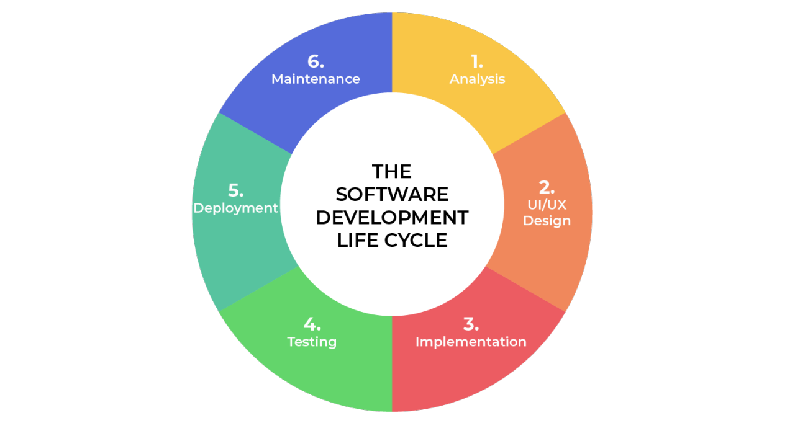

## **SOFTWARE DEVELOPMENT LIFE CYCLE**

### **Introduction**
The software development lifecycle (SDLC) is the cost-effective and time-efficient process that development teams use to design and build high-quality software. The goal of SDLC is to minimize project risks through forward planning so that software meets customer expectations during production and beyond. This methodology outlines a series of steps that divide the software development process into tasks you can assign, complete, and measure.

Software development can be challenging to manage due to changing requirements, technology upgrades, and cross-functional collaboration. The software development lifecycle (SDLC) methodology provides a systematic management framework with specific deliverables at every stage of the software development process. As a result, all stakeholders agree on software development goals and requirements upfront and also have a plan to achieve those goals.

### **SOFTWARE DEVELOPMENT LIFE CYCLE PHASES**

The software development lifecycle (SDLC) outlines several tasks required to build a software application. The development process goes through several stages as developers add new features and fix bugs in the software. The details of the SDLC process vary for different teams. However, we outline some common SDLC phases below. 

#### 1. **Plan**
 The planning phase typically includes tasks like cost-benefit analysis, scheduling, resource estimation, and allocation. The development team collects requirements from several stakeholders such as customers, internal and external experts, and managers to create a software requirement specification document.

 #### 2. **Design**
In the design phase, software engineers analyze requirements and identify the best solutions to create the software. For example, they may consider integrating pre-existing modules, make technology choices, and identify development tools. They will look at how to best integrate the new software into any existing IT infrastructure the organization may have.

#### 3. **Implement**

In the implementation phase, the development team codes the product. They analyze the requirements to identify smaller coding tasks they can do daily to achieve the final result.

#### 4. **Test**

The development team combines automation and manual testing to check the software for bugs. Quality analysis includes testing the software for errors and checking if it meets customer requirements. Because many teams immediately test the code they write, the testing phase often runs parallel to the development phase.

#### 5. **Deploy**

When teams develop software, they code and test on a different copy of the software than the one that the users have access to. The software that customers use is called production, while other copies are said to be in the build environment, or testing environment. Having separate build and production environments ensures that customers can continue to use the software even while it is being changed or upgraded. The deployment phase includes several tasks to move the latest build copy to the production environment, such as packaging, environment configuration, and installation.

#### 5. **Maintain**

In the maintenance phase, among other tasks, the team fixes bugs, resolves customer issues, and manages software changes. In addition, the team monitors overall system performance, security, and user experience to identify new ways to improve the existing software.

### **SOFTWARE DEVELOPMENT LIFE CYCLE MODELS**

A software development lifecycle (SDLC) model conceptually presents SDLC in an organized fashion to help organizations implement it. Different models arrange the SDLC phases in varying chronological order to optimize the development cycle. The two (2) most popular models are waterfall and agile.

#### 1. **Waterfall**

The waterfall model arranges all the phases sequentially so that each new phase depends on the outcome of the previous phase. Conceptually, the design flows from one phase down to the next, like that of a waterfall. The waterfall model provides discipline to project management and gives a tangible output at the end of each phase. However, there is little room for change once a phase is considered complete, as changes can affect the software's delivery time, cost, and quality. Therefore, the model is most suitable for small software development projects, where tasks are easy to arrange and manage and requirements can be pre-defined accurately.

#### 1. **Agile**

The agile model arranges the SDLC phases into several development cycles. The team iterates through the phases rapidly, delivering only small, incremental software changes in each cycle. They continuously evaluate requirements, plans, and results so that they can respond quickly to change. The agile model is both iterative and incremental, making it more efficient than other process models.Rapid development cycles help teams identify and address issues in complex projects early on and before they become significant problems. They can also engage customers and stakeholders to obtain feedback throughout the project lifecycle. However, overreliance on customer feedback could lead to excessive scope changes or end the project midway.

###### Reference: https://aws.amazon.com/what-is/sdlc/