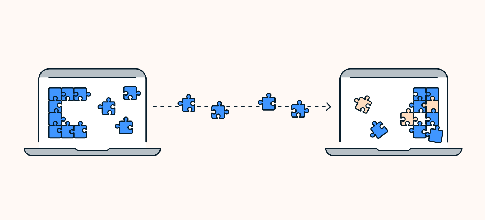

## **Transmission Control Protocol (TCP)**

Protocols are rules that govern how data is formatted and sent over a network. TCP and UDP are two different methods for doing the same job: transferring data via the internet. They enable servers and devices to communicate so you can send emails, watch Netflix, play games, and browse web pages.

TCP creates a secure communication line to ensure the reliable transmission of all data. Once a message is sent, the receipt is verified to make sure all the data was transferred.

### **How TCP works**

TCP works by using a “three-way handshake” — a three-step process that forms a connection between a device and a server. The completion of the three-step process establishes the non-stop connection, starts the transfer of data packets across the internet, delivers them intact, and acknowledges delivery.

Here’s how TCP works:

1. The client device initiating the data transfer sends a sequence number (SYN) to the server. It tells the server the number that the data packet transfer should begin with.

2. The server acknowledges the client SYN and sends its own SYN number. This step is often referred to as SYN-ACK (SYN acknowledgement).

3. The client then acknowledges (ACK) the server’s SYN-ACK, which forms a direct connection and begins the data transfer.

The connection between the sender and receiver is maintained until the transfer is successful. Every time a data packet is sent, it requires an acknowledgment from the receiver. So, if no acknowledgment is received, the data is resent.

If an error is acknowledged, the faulty packet is discarded and the sender delivers a new one. Heavy traffic or other issues may also prevent data from being sent. In that case, the transmission is delayed (without breaking the connection).Thanks to these controls, successful data delivery is guaranteed with TCP.

### **Advantages of TCP**

Transmission control protocol (TCP) is the protocol to choose for maximum reliability and quality. It may not be the fastest, but it gets the job done right. Here are a few advantages of the TCP protocol:

- It sets up and maintains a connection between sender and receiver.

- It operates independently of the operating system.

- It supports many routing protocols.

- It checks for errors, guaranteeing data arrives at its destination unaltered.

- It confirms data arrival after delivery, or attempts to retransfer.

- It’s able to send data in a particular sequence.

- It optimizes the pace of data transmission based on the receiver.

### **Disadvantages of TCP**

TCP isn’t suited for some types of data transfers, especially ones that require faster speeds. These are the drawbacks of TCP packet transmission:

- It uses more bandwidth and is slower than UDP.

- It’s especially slow at the beginning of a file transfer.

- It can prevent data from loading if some data is lost. For example, it won’t load images on a web page until all of the page data has been delivered.

- It reduces its transfer rate if the network is congested, resulting in even slower speeds.

- It’s not suited for LAN and PAN networks.

- It can’t multicast or broadcast

### **Application of TCP**

When should you enable TCP data transfer? Most data transfers automatically use the best protocol option. But in certain circumstances — such as when using a VPN — you may need to choose a protocol to optimize your browsing experience. Enable TCP for the following activities:

- Email and text messaging

- Streaming pre-recorded content on sites like Netflix, Hulu, or HBO Max

- Transferring files between apps and devices

- General web browsing

- Remote device or network administration

## **User Datagram Protocol (UDP)**

UDP does not establish a connection when sending data. It sends data without confirming receipt or checking for errors. That means some or all of the data may be lost during transmission.

### **How UDP works**

The UDP protocol works by immediately firing data at the receiver who made a data transmission request, until the transmission is complete or terminated. Sometimes called a “fire-and-forget” protocol, UDP fires data at a recipient in no particular sequence, without confirming delivery or checking if packets arrived as intended.

While TCP establishes a formal connection via its “handshake” agreement before sending data. UDP doesn’t have time for that. It speeds up data transfer by sending packets without making any agreement with a receiver. Then, it’s up to the recipient to make sense of the data.

Imagine you’re having lunch at the office and a friend in a different cubicle asks you for half of your sandwich. You have two options: You can walk through the maze of office desks and hand it to her, guaranteeing a secure delivery. Or, you can throw the sandwich into her cubicle from across the room, leaving the quality of the delivery up to her speed and reflexes.

The first method (TCP) is reliable, but slow. The second method (UDP) is fast, but the sandwich might not arrive in its original state — or at all.

### **Advantages of TCP**

UDP delivers data rapidly, and it doesn’t slow down or turn back to recollect lost data. This makes it an ideal protocol for delivering continuous data or broadcasting, such as for live streaming, video calling, and matching servers with IP addresses. Here are some of the advantages of UDP:

- No connection is needed to send or receive data, so apps and operating systems work faster.

- Broadcast and multicast transmission is available, meaning one UDP transmission can send data to multiple recipients.

- It endures packet loss, delivering data even if it's incomplete.

- Smaller packet size and less overhead reduce end-to-end delay.

- Operates over a larger range of network conditions than TCP.

- UDP communication is more efficient.

- It can transmit live and real-time data.

### **Disavantages of TCP**

While UDP provides the speed you need to live a comfortable digital life, UDP isn’t as reliable as TCP. This is something to be aware of when setting up a VPN, because most VPNs run on UDP protocols to keep connection speeds high. Here are some disadvantages of using UDP:

- It’s connectionless, which makes data transfer unreliable.

- There’s no system in place to acknowledge a successful data transfer.

- There’s no way to know if data is delivered in its original state, or at all.

- It has no error control, so it drops packets when errors are detected.

- In case of a data collision, routers will often drop UDP packets and favor TCP packets.

- Multiple users accepting UDP data can cause congestion, and there’s no way to mitigate this.

- It cannot sequence data, so data can arrive in any order or out of order.

### **Application of TCP**

UDP is best suited for transferring a steady flow of live data. This allows many users to access data easily and quickly, if not in perfect condition. A good example is playing an online game. UDP can keep the action moving in spite of potential errors or data loss. Here are a few applications of UDP in real life.

- Online gaming

- Multicasting

- Video chatting/conferencing

- VoIP (in-app voice calling)

- Domain Name Systems (which translates domain names into IP addresses)

###### Reference : https://www.avast.com/c-tcp-vs-udp-difference#:~:text=TCP%20is%20best%20used%20for,is%20more%20important%20than%20reliability.