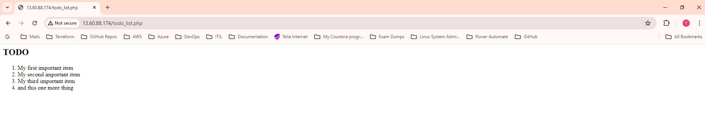

## **LEMP STACK IMPLEMENTATION IN AWS**

### **Introduction**
LEMP is an open-source web application stack used to develop web applications. The term LEMP is an acronym that represents L for the Linux Operating system, Nginx (pronounced as engine-x, hence the E in the acronym) web server, M for MySQL database, and P for PHP scripting language.

### **Prerequisites**
1. An AWS account with appropriate permissions to create and manage EC2 instances, Security Groups, and Key Pairs.
2. Basic familiarity with AWS services and the Linux command line interface.

### **Step 0 : Set up EC2 Instance**
#### 1. Lunch EC2 instance type of t3.micro and Ubuntu 24.04 LTS (HVM) AMI type in eu-north-1 region.


#### 2. Create ssh key to access the EC2 server for secure access to the EC2 instance.
#### 3. Configure network security group to allow traffic on port 80 for HTTP connection, port 443 for HTTPS connectiona nd port 22 for SSH connection to the EC2 server.


#### 4. Conect to EC2 Instance via SSH
Before connecting to the instance, chnage the permission for the downloaded ssh key  to ensure your key is not publicly viewable with the command below:

```bash
sudo chmod 400 <private-key-name>.pem
```

After chnaging the permission . connect to the instance with the command below:

```bash
ssh -i "<private-key-name>.pem" ubuntu@<ip-address or dns-name>
```


### **Step 1 : Install Nginx Web Server**

#### 1. Update and Upgrade the packages on the EC2 server

```bash
sudo apt update
sudo apt upgrade -y
```

 


#### 2. Install Nginx using Ubuntu's package manager "apt"

```bash
sudo apt install nginx -y
```


#### 3. Enable the apache service and confirm it is running

```bash
sudo systemctl enable nginx
sudo systemctl status nginx
```


#### 4. Check if server is running, can be accessed locally and from internet (source 0.0.0.0/0 means from any IP)

```bash
curl http://localhost:80
curl http://127.0.0.1:80
```


#### 5. Test how the Nginx  server respond to requests from internet via a web browser.

```bash
http://<public-ip>:80
```


#### 6. Another way to retrieve the public ip address other than check the aws console.

```bash
curl -s http://169.254.169.254/latest/meta-data/public-ipv4
```
Before runnng the above command, change the IMDSv2 of the instance on aws console following the steps below: 

- Actions > Instance Settings > Modify instance metadata options.
- Then change the IMDSv2 from Required to Optional.


After that run the command 

```bash
curl -s http://169.254.169.254/latest/meta-data/public-ipv4
```


### **Step 2 : Install MySQL**

#### 1. Install MySQL using Ubuntu's package manager "apt"

```bash
sudo apt install mysql-server -y
```


#### 2. Enable the mysql service and confirm it is running

```bash
sudo systemctl enable mysql
sudo systemctl status mysql
```


#### 3. Log in to MySQL conole

```bash
sudo mysql
```
This will connect to MySQL server as the administrative database root user, which is inferred by the use of sudo when running this command.


#### 4. Set a password for the root user, using mysql_native_password as deafult authentication method.

```bash
ALTER USER 'root'@'localhost' IDENTIFIED WITH mysql_native_password BY 'PassWord.1';
```


#### 5. Run security script to remove some insure default settings and lock down acces to database system. This script comes pre-installed with MySQL. Before running the script, It is important to set a password for the root user which has been done in setp 4. Before running the script exit the MySQL shell

```bash
exit

sudo mysql_secure_installation -y
```


#### 6. Re-login into MySQL console to test the new credentails and exit

```bash
sudo mysql -p
exit
```


### **Step 3 : Install PHP**

#### 1. Install PHP using Ubuntu's package manager "apt"

```bash
sudo apt install php-fpm php-mysql -y
```


#### 2. Check PHP version


### **Step 4 : Configure Nginx to use PHP Processor**

Whne using the Nginx web server, we can create server blocks (simlar to virtual hosts in Apache) to encapsulate configuration details and hosts more than one domain on a single server. Nginx has one server block enabled by default and is configured to server documents out of a directory /var/www/hml. While it works well for a single site, It can become difficult to manage when hosting multiple sites. Instead of modifying /var/www/html, the directory structure within /var/www the domain website, leaving /var/www/html in place as the default directory to be served if a client request does not match any other sites.

#### 1. Create the root web directoryfor the domain named projectLEMP as follows:

```bash
sudo mkdir /var/www/projectLEMP
```


#### 2. Assign ownership of the directory created in step 1 to the $USER environment variable, which will reference the current system user.

```bash
sudo chown -R $USER:$USER /var/www/projectLEMP
```


#### 3. Create and open a new configuration file in Nginx's sites-avaialbale directory.

```bash
sudo vi /etc/nginx/sites-available/projectLEMP
```
And paste the following configuration in the file: 

```bash
server {
  listen 80;
  server_name projectLEMP www.projectLEMP;
  root /var/www/projectLEMP;

  index index.html index.htm index.php;

  location / {
    try_files $uri $uri/ =404;
  }

  location ~ \.php$ {
    include snippets/fastcgi-php.conf;
    fastcgi_pass unix:/var/run/php/php8.1-fpm.sock;
  }

  location ~ /\.ht {
    deny all;
  }
}
```


#### 4. Activate the configuration in step 3 by linking to the config file from Nginx's sites-enabled directory

```bash
sudo ln -s /etc/nginx/sites-available/projectLEMP /etc/nginx/sites-enabled
```
This will tell Nginx to use the configuration next time it is reloaded. You can test the configuration for syntax error by typing

```bash
sudo nginx -t
```


#### 5. Disbale the default Nginx host
Disbale the default Nginx host that is currently configured to listen on port 80, for this run:

```bash
sudo unlink /etc/nginx/sites-enabled/default
```

After that, reload Nginx to effect the chnages:

```bash
sudo systemctl reload nginx
```


#### 6. The new website is now active, but the web root /var/www/projectLEMP is still empty. Create an index.html file in that location so that the new server block can be tested.

```bash
sudo echo 'Hello LEMP from hostname' $(curl -s http://169.254.169.254/latest/meta-data/public-hostname) 'with public IP' $(curl -s http://169.254.169.254/latest/meta-data/public-ipv4) > /var/www/projectLEMP/index.html
```


#### 7. Open the new website in a web browser

```bash
http://<Public-IP-Address>:80

http://<Public-DNS-Name>:80
```


### **Step 5 : Test PHP with Nginx**

You van test to validate that Nginx can correctly hand .php files off to the PHP processor.

#### 1. Create a PHP file in the document root. Open a new file called info.php within the root in text editor.

```bash
sudo vi /var/www/projectLEMP/info.php
```
Paste the following command in the file

```bash
<?php
phpinfo();
```


Access the php info page in web browser by visting the domain name or public ip set in the Nginx configuration file followed by /info.php

```bash
http://<Public-IP-Address>/info.php
```


After accessing the endpoint on the web browser, an error 502 bad gateway output. To resolve this error chnage the php-version in the /etc/nginx/sites-available/projectLEMP file to 8.3 as shown below.


After chnaging the php version, try access the page on the web browser.


#### 1. After checking the relevant information about PHP server through the page, It is best to remove the file as it contains sensitive information about the PHP environment and Ubuntu server. 

```bash
sudo rm /var/www/projectLEMP/info.php
```

### **Step 6 : Retrieve data from MySQL Database with PHP**

In this step a test database with sample "To Do List" and configure access to it, so the Nginx website would be able to query data from the DB and display it. At the time of this writing, the native MySQL PHP library mysqlnd doesn't support caching_sha2_authentication, the default authentication method for MySQl 8. There will be need to create a new user with mysql_native_password authentication method in order to be bale to connect to the MySQL database from PHP.

A database named example_database and a user named example_user, the names can be replaced with different values.

#### 1. login to MySQL console

```bash
sudo mysql -p
```

#### 2. Create a new database, run the following command from MySQL console

```sql
CREATE DATABASE 'example_database';
```


#### 3. Create a new user and grant user full privileges on the database created in step 2.

```sql
CREATE USER 'example_user'@'%' IDENTIFIED WITH mysql_native_password BY 'Password.12345';

GRANT ALL ON example_database.* TO 'example_user'@'%';
```


#### 4. Login into MySQL console with the new user credntials created in step 3 above. Before logging in, exit MySQl shell.

```sql
exit

mysql -u example_user -p
```


After that, use the below syntax to show the existing databases

```sql
SHOW DATABASES
```


#### 5. Create a table named todo_list using the below sql sysntax

```sql
CREATE TABLE example_database.todo_list (
  item_id INT AUTO_INCREMENT,
  content VARCHAR(255),
  PRIMARY KEY(item_id)
);
```

#### 6. Insert data int the table created in step 5 above.

```sql
INSERT INTO example_database.todo_list (content) VALUES ("My first important item");

INSERT INTO example_database.todo_list (content) VALUES ("My second important item");

INSERT INTO example_database.todo_list (content) VALUES ("My third important item");

INSERT INTO example_database.todo_list (content) VALUES ("and this one more thing");
```


#### 7. Query the new table create to comfirm the data were successfully inserted.

```sql
SELECT * FROM example_database.todo_list;
```


After runnng the query, exit MySQl console

```sql
exit
```

#### 7. Create a PHP script that will connect to MySQL and query for the content on the table and display the results in a list. Create a new file in the web root directory

```bash
sudo vi /var/www/projectLEMP/todo_list.php
```

Copy the below script in the new php file.

```bash
<?php
$user = "todo_user";
$password = "Admin123$";
$database = "todo_database";
$table = "todo_list";

try {
  $db = new PDO("mysql:host=localhost;dbname=$database", $user, $password);
  echo "<h2>TODO</h2><ol>";
  foreach($db->query("SELECT content FROM $table") as $row) {
    echo "<li>" . $row['content'] . "</li>";
  }
  echo "</ol>";
} catch (PDOException $e) {
    print "Error!: " . $e->getMessage() . "<br/>";
    die();
}
?>
```


#### 8. Access the page on the browser by using the domain name or public IP address followed by /todo_list.php

```bash
http://<Public-IP-Address>/todo_list.php
```

