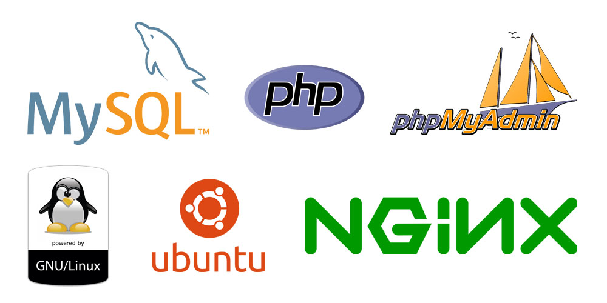

## **Linux Nginx MySQL PHP (LAMP) Stack**

### **Introduction**

LEMP is an open-source web application stack used to develop web applications. The term LEMP is an acronym that represents L for the Linux Operating system, Nginx (pronounced as engine-x, hence the E in the acronym) web server, M for MySQL database, and P for PHP scripting language.

The LEMP stack is a combination of four open-source technologies that are used in web development. These technologies include:

- Linux: The operating system that runs the web server.
- Nginx: The web server software that handles HTTP requests.
- MySQL: The relational database management system that stores the website’s data.
- PHP: The programming language used to build dynamic web applications.

### **How does the LEMP Stack work**

The LEMP stack works by using Nginx as the web server, which listens for HTTP requests and forwards them to the appropriate PHP script. The PHP script generates a response, which is then sent back to the user via Nginx. MySQL is used to store and manage the website’s data. PHP communicates with MySQL to retrieve and store data as needed.

The LEMP stack is popular in web development for several reasons:

- High performance: Nginx is known for its high performance, making it an excellent choice for handling large amounts of traffic.
- Scalability: The LEMP stack is highly scalable, making it a good choice for websites that need to handle a large volume of traffic.
- Open-source: All of the components of the LEMP stack are open-source, making it cost-effective for web developers.
- Flexibility: The LEMP stack is flexible and can be customized to fit the specific needs of a website.
- Security: The LEMP stack is known for its security, with Nginx providing several security features, such as SSL encryption and DDoS protection.

### **Components of LEMP Stack**

#### 1. L stands for Linux: 
The web server runs on the Linux operating system. It is free and open-source and well known to be highly secure and less vulnerable to malware and viruses even if compared to Windows or macOS. Why use Linux?

- Highly secure.
- Highly stable.
- Free and open-source.
- Strong community support.
- Flexible in customization.

#### 2. N stands for Nginx
It is a web server that follows an event-driven approach and handles multiple requests within one thread. Nginx supports all Unix-like OS and also supports windows partially.
When a web browser requests a web page that request is handled by the web server, here that web server is Nginx. Then the web server passes that request to server-side technologies used in the LEMP stack for instance as a server-side scripting language like PHP to communicate with the server and database. Why use Nginx?

- Simple installations and configurations.
- Load balancing support.
- More concurrent connections can be handled compared to Apache.
- Fastest for serving static files.
- Compatible with commonly-used applications.

#### 3. M stands for MySQL

It is an open-source SQL-based database that is used to store data and manipulate data while maintaining data consistency and integrity. It organizes data in tabular form in rows and columns. It is also ACID-compliant. Why use MySQL?

- It is Open-source.
- Strong data protection.
- Highly extensible
- High performance.
- Scalability and Flexibility

#### 4. P stands for PHP

It stands for Hypertext Preprocessor and is a scripting language that works on the server-side and communicates with the database MySQL and does all operations which the user requests like fetching data, adding data, or manipulating data, or processing the data. Why use PHP?

- Large community support.
- More options for database connectivity.
- Inexpensive web hosting.
- Open-source and free.
- The most popular CMS WordPress runs on PHP

### **Advantages Of LEMP**

- One of the benefits of using LEMP is its widespread community support.
- PHP and MySQL in the backend together are very powerful also with large community support and several hosting provider’s support.
- LEMP is open-source.
- Another benefit of LEMP is that Nginx is faster and is capable of handling a good amount of load.

### **Disadvantages Of LEMP**

- If configurations are considered Nginx does not allow additional configurations which is a downside unlike Apache as it is more flexible in this case.
- Not flexible enough to support dynamic modules and loading.

###### Reference: https://www.geeksforgeeks.org/what-is-lemp-stack/