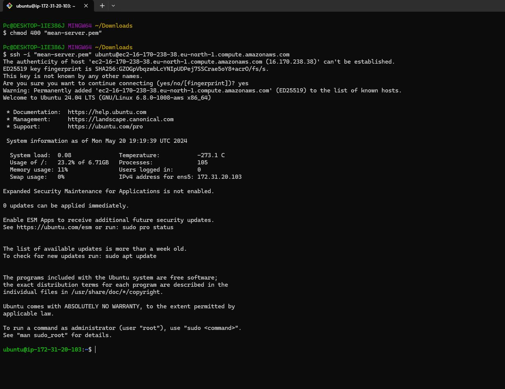

<h2><b>MEAN STACK IMPLEMENTATION IN AWS</b></h2>

<h3><b>Introduction</b></h3>

The MEAN stack is a JavaScript-based framework for developing scalable web applications. The term MEAN is an acronym for MongoDB, Express, Angular, and Node — the four key technologies that make up the layers of the technology stack.

<h3><b>Prerequisites</b></h3>
<ol><li> An AWS account with appropriate permissions to create and manage EC2 instances, Security Groups, and Key Pairs. </li>

<li>Basic familiarity with AWS services and the Linux command line interface.</ol></li>

<h3><b>Step 0 : Set up EC2 Instance</b></h3>

#### 1. Lunch EC2 instance type of t3.small and Ubuntu 24.04 LTS (HVM) AMI type in eu-north-1 region.


#### 2. Create ssh key to access the EC2 server for secure access to the EC2 instance.
#### 3. Configure network security group to allow traffic on port 80 for HTTP connection, port 443 for HTTPS connectiona nd port 22 for SSH connection to the EC2 server.

#### 4. Conect to EC2 Instance via SSH
Before connecting to the instance, change the permission for the downloaded ssh key  to ensure your key is not publicly viewable with the command below:

```bash
sudo chmod 400 <private-key-name>.pem
```

After chnaging the permission, connect to the instance with the command below:

```bash
ssh -i "<private-key-name>.pem" ubuntu@<ip-address or dns-name>
```


<h3><b>Step 1 : Install Nodejs</b></h3>

#### 1. Update and Upgrade the packages on the EC2 server

```bash
sudo apt update
sudo apt upgrade -y
```

 


#### 2. Add certificates

```bash
sudo apt -y install curl dirmngr apt-transport-https lsb-release ca-certificates

curl -sL https://deb.nodesource.com/setup_18.x | sudo -E bash -

```


#### 3. Install Nodejs using Ubuntu's package manager "apt"

```bash
sudo apt install -y nodejs
```


<h3><b>Step 2 : Install MongoDB</b></h3>

MongoDB stores data in flexible, JSON-like documents. Fields in a databasecan vary from document to document and data structure can be changedover time. For our example application, we are adding book records toMongoDB that contain book name, isbn number, author, and number ofpages.

#### 1. Download the MongoDB public GPG key

```bash
curl -fsSL https://pgp.mongodb.com/server-7.0.asc | sudo gpg --dearmor -o /usr/share/keyrings/mongodb-archive-keyring.gpg
```

#### 2. Create a list file for MongoDB

```bash
echo "deb [ signed-by=/usr/share/keyrings/mongodb-archive-keyring.gpg ] https://repo.mongodb.org/apt/ubuntu jammy/mongodb-org/7.0 multiverse" | sudo tee /etc/apt/sources.list.d/mongodb-org-7.0.list
```


#### 3. Reload local package database

```bash
sudo apt-get update
```


#### 4. Install the MongoDB packages

```bash
sudo apt-get install -y mongodb-org
```


#### 5. Start the mongodb service

```bash
sudo service mongod start
```

#### 6. Start and enable mongodb service. aThen check the status

```bash
sudo systemctl start mongod

sudo systemctl enable mongod

sudo systemctl status mongod
```


#### 7. Install npm-Node package manager

```bash
sudo apt install npm -y
```

#### 8. Install body-parser package

'body-parser' package is needed to process JSON files passed inrequests to the server.

```bash
sudo npm install body-parser
```


#### 9. Create a folder named Books cd into the folder

```bash
mkdir Books && cd Books
```

#### 10. In the Books directory, initialise npm project

```bash
npm init
```


#### 11. Add file named server.js to Books folder. Copy and paste the web server code below into the file

```bash
vi server.js
```

```bash
const express = require('express');
const bodyParser = require('body-parser');
const mongoose = require('mongoose'); // Make sure mongoose is installed and required
const path = require('path'); // To handle static file serving
const app = express();

// Connect to MongoDB
mongoose.connect('mongodb://localhost:27017/test', { useNewUrlParser: true, useUnifiedTopology: true })
  .then(() => console.log('MongoDB connected'))
  .catch(err => console.error('MongoDB connection error:', err));

// Middleware
app.use(bodyParser.json());
app.use(express.static(path.join(__dirname, 'public')));

// Routes
require('./apps/routes')(app);

// Start the server
app.set('port', 3300);
app.listen(app.get('port'), () => {
  console.log('Server up: http://localhost:' + app.get('port'));
});
```


<h3><b>Step 3 : Install Express and set up routes to the server</b></h3>

Express is a minimal and flexible Node.js
web application framework thatprovides features for web and mobile applications. We will use Express in topass book information to and from our MongoDB database. We also will use Mongoose package which provides a straight-forward,schema-based solution to model your application data. We will useMongoose to establish a schema for the database to store data of ourbook register.

#### 1. Install express and mongoose with npm package manager

```bash
sudo npm install express mongoose
```


#### 2. In the Books folder, create a folder named apps and cd into it.

```bash
mkdir apps && cd apps
```
#### 3. Create a file named routes.js. Copy and paste the code below into routes.js file

```bash
vi routes.js
```

```bash
const Book = require('./models/book');
const path = require('path');

module.exports = function(app) {
  // Get all books
  app.get('/book', async (req, res) => {
    try {
      const books = await Book.find({});
      res.json(books);
    } catch (err) {
      console.error(err);
      res.status(500).json({ error: 'Internal Server Error' });
    }
  });

  // Add a new book
  app.post('/book', async (req, res) => {
    try {
      const book = new Book({
        name: req.body.name,
        isbn: req.body.isbn,
        author: req.body.author,
        pages: req.body.pages
      });
      const result = await book.save();
      res.json({
        message: "Successfully added book",
        book: result
      });
    } catch (err) {
      console.error(err);
      res.status(500).json({ error: 'Internal Server Error' });
    }
  });

  // Update a book
  app.put('/book/:isbn', async (req, res) => {
    try {
      const updatedBook = await Book.findOneAndUpdate(
        { isbn: req.params.isbn },
        req.body,
        { new: true }
      );
      if (!updatedBook) {
        return res.status(404).json({ error: 'Book not found' });
      }
      res.json({
        message: "Successfully updated the book",
        book: updatedBook
      });
    } catch (err) {
      console.error(err);
      res.status(500).json({ error: 'Internal Server Error' });
    }
  });

  // Delete a book
  app.delete('/book/:isbn', async (req, res) => {
    try {
      const result = await Book.findOneAndRemove({ isbn: req.params.isbn });
      if (!result) {
        return res.status(404).json({ error: 'Book not found' });
      }
      res.json({
        message: "Successfully deleted the book",
        book: result
      });
    } catch (err) {
      console.error(err);
      res.status(500).json({ error: 'Internal Server Error' });
    }
  });

  // Serve static files
  app.get('*', (req, res) => {
    res.sendFile(path.join(__dirname, '../public', 'index.html'));
  });
};
```


#### 4. In the apps folder create a folder named models and cd into it. 

```bash
mkdir models && cd models
```

#### 5. In the models folder, create a file named book.js. Copy and paste the code below into book.js file

```bash
vi book.js
```

```bash

const mongoose = require('mongoose');

const bookSchema = new mongoose.Schema({
  name: { type: String, required: true },
  isbn: { type: String, required: true, unique: true },
  author: { type: String, required: true },
  pages: { type: Number, required: true }
});

module.exports = mongoose.model('Book', bookSchema);

```


<h3><b>Step 4 : Access the routes with AngularJS</b></h3>

AngularJS provides a web framework for creating dynamic views in yourweb applications. In this tutorial, we use AngularJS to connect our webpage with Express and perform actions on our book register.

##### 1. Change the present working directory to Books. Create a folder named public and cd into it

```bash
cd ../..
```
```bash
mkdir public && cd public
```

##### 2. In the public folder, create a file named script.js and paste the code below in the file

```bash
vi script.js
```

```bash
var app = angular.module('myApp', []);

app.controller('myCtrl', function($scope, $http) {
  // Get all books
  function getAllBooks() {
    $http({
      method: 'GET',
      url: '/book'
    }).then(function successCallback(response) {
      $scope.books = response.data;
    }, function errorCallback(response) {
      console.log('Error: ' + response.data);
    });
  }

  // Initial load of books
  getAllBooks();

  // Add a new book
  $scope.add_book = function() {
    var body = {
      name: $scope.Name,
      isbn: $scope.Isbn,
      author: $scope.Author,
      pages: $scope.Pages
    };
    $http({
      method: 'POST',
      url: '/book',
      data: body
    }).then(function successCallback(response) {
      console.log(response.data);
      getAllBooks();  // Refresh the book list
      // Clear the input fields
      $scope.Name = '';
      $scope.Isbn = '';
      $scope.Author = '';
      $scope.Pages = '';
    }, function errorCallback(response) {
      console.log('Error: ' + response.data);
    });
  };

  // Update a book
  $scope.update_book = function(book) {
    var body = {
      name: book.name,
      isbn: book.isbn,
      author: book.author,
      pages: book.pages
    };
    $http({
      method: 'PUT',
      url: '/book/' + book.isbn,
      data: body
    }).then(function successCallback(response) {
      console.log(response.data);
      getAllBooks();  // Refresh the book list
    }, function errorCallback(response) {
      console.log('Error: ' + response.data);
    });
  };

  // Delete a book
  $scope.delete_book = function(isbn) {
    $http({
      method: 'DELETE',
      url: '/book/' + isbn
    }).then(function successCallback(response) {
      console.log(response.data);
      getAllBooks();  // Refresh the book list
    }, function errorCallback(response) {
      console.log('Error: ' + response.data);
    });
  };
});
```


##### 3. In the public folder, create a file named index.html and paste the code below in the file

```bash
vi index.html
```

```bash
<!DOCTYPE html>
<html ng-app="myApp" ng-controller="myCtrl">
<head>
  <script src="https://ajax.googleapis.com/ajax/libs/angularjs/1.6.4/angular.min.js"></script>
  <script src="script.js"></script>
  <style>
    /* Add your custom CSS styles here */
  </style>
</head>
<body>
  <div>
    <table>
      <tr>
        <td>Name:</td>
        <td><input type="text" ng-model="Name"></td>
      </tr>
      <tr>
        <td>Isbn:</td>
        <td><input type="text" ng-model="Isbn"></td>
      </tr>
      <tr>
        <td>Author:</td>
        <td><input type="text" ng-model="Author"></td>
      </tr>
      <tr>
        <td>Pages:</td>
        <td><input type="number" ng-model="Pages"></td>
      </tr>
    </table>
    <button ng-click="add_book()">Add</button>
    <div ng-if="successMessage">{{ successMessage }}</div>
    <div ng-if="errorMessage">{{ errorMessage }}</div>
  </div>
  <hr>
  <div>
    <table>
      <tr>
        <th>Name</th>
        <th>Isbn</th>
        <th>Author</th>
        <th>Page</th>
        <th>Action</th>
      </tr>
      <tr ng-repeat="book in books">
        <td>{{ book.name }}</td>
        <td>{{ book.isbn }}</td>
        <td>{{ book.author }}</td>
        <td>{{ book.pages }}</td>
        <td><button ng-click="del_book(book)">Delete</button></td>
      </tr>
    </table>
  </div>
</body>
</html>
```


##### 4. Change directory back to Books

```bash
cd ..
```

##### 5. Start teh server by running the command below

```bash
node server.js
```


##### 6. The server is now up and running, we can connect it via port 3300. You canlaunch a separate Putty or SSH console to test what curl command returnslocally.

```bash
curl -s http://localhost:3300
```


##### 7. Access thye web application through a web browser

```bash
http://<ip-address>:3300
```


##### 8. Test the functionality of the web application by add books


