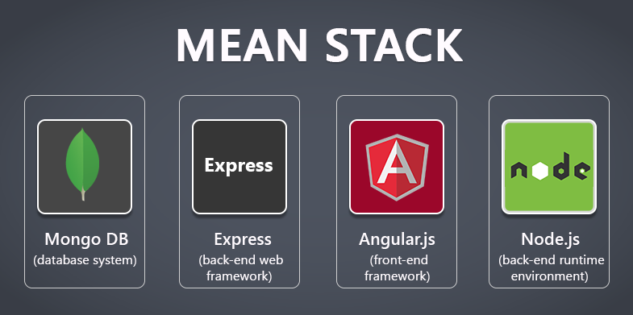

<h2><b>MEAN STACK IMPLEMENTATION</b></h2>

<h3><b>Introduction</b></h3>

The MEAN stack is a JavaScript-based framework for developing scalable web applications. The term MEAN is an acronym for MongoDB, Express, Angular, and Node — the four key technologies that make up the layers of the technology stack.
<ul>
<li>MongoDB: A NoSQL, object-oriented database designed for use with cloud applications.</li>

<li>Express(.js): A web application framework for Node(.js) that supports interactions between the front end (e.g., the client side) and the database.</li>

<li>Angular(.js): Often referred to as the “front end"; a client-side JavaScript framework used to create dynamic web applications to work with interactive user interfaces. </li>

<li>Node(.js): The premier JavaScript web server used to build scalable network applications</li></ul>

<h3><b> Components of MEAN Stack</b></h3>

<ul>
<li><b>Angular.js front end</b>

At the very top of the MEAN stack is Angular.js, the self-styled “JavaScript MVW Framework” (MVW stands for “Model View and Whatever”).

Angular.js allows you to extend your HTML tags with metadata in order to create dynamic, interactive web experiences much more powerfully than, say, building them yourself with static HTML and JavaScript (or jQuery).

Angular has all of the bells and whistles you’d expect from a front-end JavaScript framework, including form validation, localization, and communication with your back-end service. </li>

<li><b>Express.js and Node.js server tier</b>

The next level down is Express.js, running on a Node.js server. Express.js calls itself a “fast, unopinionated, minimalist web framework for Node.js,” and that is indeed exactly what it is.

Express.js has powerful models for URL routing (matching an incoming URL with a server function), and handling HTTP requests and responses. By making XML HTTP requests (XHRs), GETs, or POSTs from your Angular.js front end, you can connect to Express.js functions that power your application.

Those functions, in turn, use MongoDB’s Node.js drivers, either via callbacks or promises, to access and update data in your MongoDB database. </li>

<li><b>MongoDB database tier</b>

If your application stores any data (user profiles, content, comments, uploads, events, etc.), then you’re going to want a database that’s just as easy to work with as Angular, Express, and Node.

That’s where MongoDB comes in: JSON documents created in your Angular.js front end can be sent to the Express.js server, where they can be processed and (assuming they’re valid) stored directly in MongoDB for later retrieval.

If you want to easily get the best of MongoDB, you’ll want to look at MongoDB Atlas. This will allow you built-in full database security and cross-cloud scalability with the click of a button. More on that later on this page.</li></ul>

<h3><b> Advantages of MEAN Stack</b></h3>

MEAN applications can be used in many ways with a cross-platform write-once approach. While MEAN is particularly suited to real-time applications, particularly those running natively in the cloud and single-page (dynamic) web applications built in Angular.js, it can be used for other use cases, such as:

<ul>
<li> Workflow management tools. </li>
<li> News aggregation sites. </li>
<li> Todo and calendar applications. </li>
<li> Interactive forums. </li>
</ul>

There are many more uses for the MEAN stack, as well.

Since all the components are based on JavaScript and JSON, the integration between the components of the stack is intuitive and straightforward.

Additionally, the E and A of MEAN (Express and Angular) are two of the most popular and well-supported JavaScript frameworks for back-end and front-end development, respectively. Express makes routing and managing HTTP requests and responses super easy and includes great support for middleware to handle JSON endpoints and form posts. Angular is a powerful tool for building dynamic HTML pages that communicate with a back-end server.

Whether you’re building a high-throughput API, a simple web application, or a microservice, MEAN is the ideal stack for building Node.js applications.

All of the MEAN stack components are open source in nature and therefore allow a generous, free-of-charge opportunity for developers.

<h3><b> Disadvantages of MEAN Stack</b></h3>

JavaScript is a great modern language, but it wasn’t initially designed to build back-end servers. Since the foundation of the MEAN stack is JavaScript, including the back-end server, it might come with concurrency and performance problems at scale due to JavaScript nature.

Additionally, since the development opportunity is so rapid, business and server logic might suffer from poor isolation, making potential spaghetti code and bad practices a reality along the way.

Finally, although there are many guides and tutorials out there, they generally will not include concrete JS coding guidelines appropriate for this stack. Therefore, something that worked really well for one application might surface issues for another.

<h6>Reference</h6>

 https://www.mongodb.com/resources/languages/mean-stack#:~:text=The%20MEAN%20stack%20is%20a,for%20use%20with%20cloud%20applications
