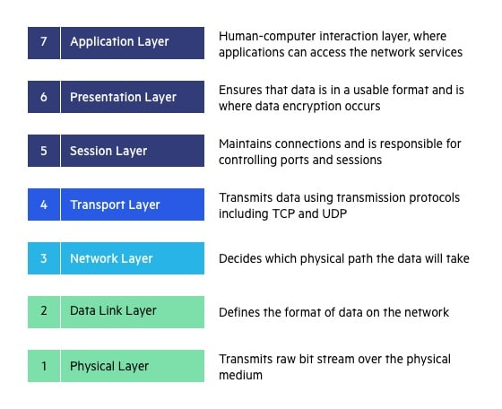

<h2><b>OPEN SYSTEMS INTERCONNECTION (OSI) MODEL</b></h2>

<h3><b>Introduction</b></h3>

The Open Systems Interconnection (OSI) model describes seven layers that computer systems use to communicate over a network. It was the first standard model for network communications, adopted by all major computer and telecommunication companies in the early 1980s

The modern Internet is not based on OSI, but on the simpler TCP/IP model. However, the OSI 7-layer model is still widely used, as it helps visualize and communicate how networks operate, and helps isolate and troubleshoot networking problems.

OSI was introduced in 1983 by representatives of the major computer and telecom companies, and was adopted by ISO as an international standard in 1984.

We’ll describe OSI layers “top down” from the application layer that directly serves the end user, down to the physical layer.

7. Application Layer

The application layer is used by end-user software such as web browsers and email clients. It provides protocols that allow software to send and receive information and present meaningful data to users. A few examples of application layer protocols are the Hypertext Transfer Protocol (HTTP), File Transfer Protocol (FTP), Post Office Protocol (POP), Simple Mail Transfer Protocol (SMTP), and Domain Name System (DNS).

6. Presentation Layer

The presentation layer prepares data for the application layer. It defines how two devices should encode, encrypt, and compress data so it is received correctly on the other end. The presentation layer takes any data transmitted by the application layer and prepares it for transmission over the session layer.

5. Session Layer

The session layer creates communication channels, called sessions, between devices. It is responsible for opening sessions, ensuring they remain open and functional while data is being transferred, and closing them when communication ends. The session layer can also set checkpoints during a data transfer—if the session is interrupted, devices can resume data transfer from the last checkpoint.

4. Transport Layer

The transport layer takes data transferred in the session layer and breaks it into “segments” on the transmitting end. It is responsible for reassembling the segments on the receiving end, turning it back into data that can be used by the session layer. The transport layer carries out flow control, sending data at a rate that matches the connection speed of the receiving device, and error control, checking if data was received incorrectly and if not, requesting it again.

3. Network Layer

The network layer has two main functions. One is breaking up segments into network packets, and reassembling the packets on the receiving end. The other is routing packets by discovering the best path across a physical network. The network layer uses network addresses (typically Internet Protocol addresses) to route packets to a destination node.

2. Data Link Layer

The data link layer establishes and terminates a connection between two physically-connected nodes on a network. It breaks up packets into frames and sends them from source to destination. This layer is composed of two parts—Logical Link Control (LLC), which identifies network protocols, performs error checking and synchronizes frames, and Media Access Control (MAC) which uses MAC addresses to connect devices and define permissions to transmit and receive data.

1. Physical Layer

The physical layer is responsible for the physical cable or wireless connection between network nodes. It defines the connector, the electrical cable or wireless technology connecting the devices, and is responsible for transmission of the raw data, which is simply a series of 0s and 1s, while taking care of bit rate control.

<h3><b>Advantages of OSI Model</b></h3>

The OSI model helps users and operators of computer networks:
<ul>
<li> Determine the required hardware and software to build their network. </li>

<li> Understand and communicate the process followed by components communicating across a network. </li>

<li> Perform troubleshooting, by identifying which network layer is causing an issue and focusing efforts on that layer. 
</li></ul>

The OSI model helps network device manufacturers and networking software vendors:

<ul>
<li> Create devices and software that can communicate with products from any other vendor, allowing open interoperability. </li>
<li> Define which parts of the network their products should work with. </li>

<li> Communicate to users at which network layers their product operates – for example, only at the application layer, or across the stack.
</li></ul>

<h3><b>OSI vs. TCP/IP Model</b></h3>

The Transfer Control Protocol/Internet Protocol (TCP/IP) is older than the OSI model and was created by the US Department of Defense (DoD). A key difference between the models is that TCP/IP is simpler, collapsing several OSI layers into one:

<ul>
<li> OSI layers 5, 6, 7 are combined into one Application Layer in TCP/IP. </li>
<li> OSI layers 1, 2 are combined into one Network Access Layer in TCP/IP – however TCP/IP does not take responsibility for sequencing and acknowledgement functions, leaving these to the underlying transport layer. </li>

<li> TCP/IP is a functional model designed to solve specific communication problems, and which is based on specific, standard protocols. OSI is a generic, protocol-independent model intended to describe all forms of network communication. </li>
<li> In TCP/IP, most applications use all the layers, while in OSI simple applications do not use all seven layers. Only layers 1, 2 and 3 are mandatory to enable any data communication.
</li></ul>

<h6>Reference</h6>

 https://www.imperva.com/learn/application-security/osi-model/
