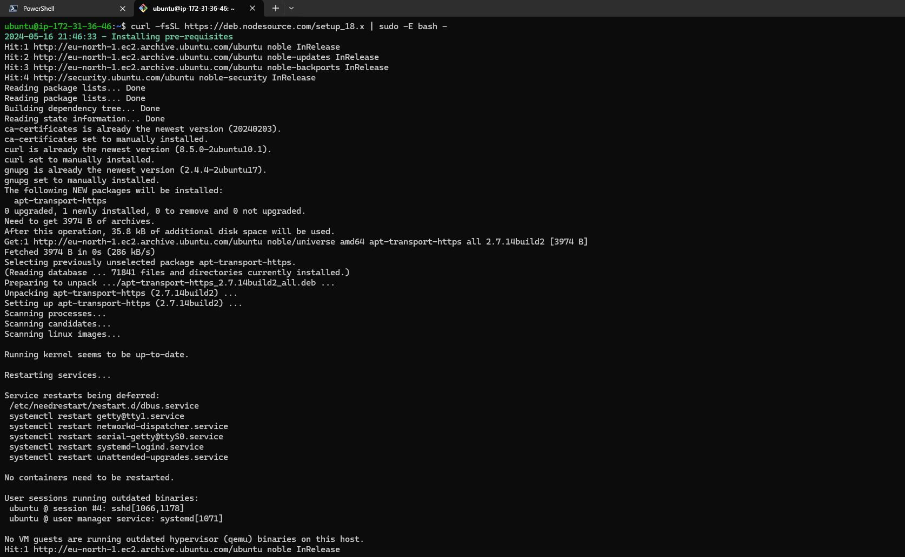
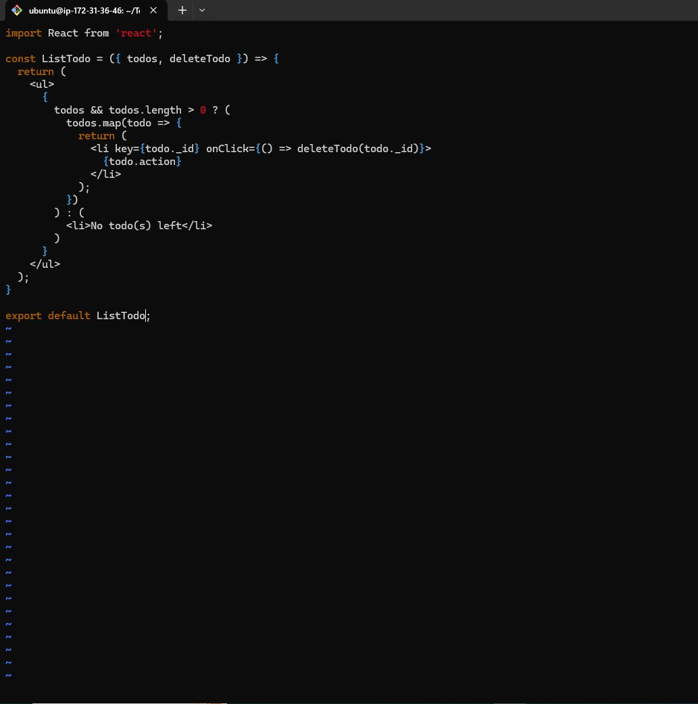
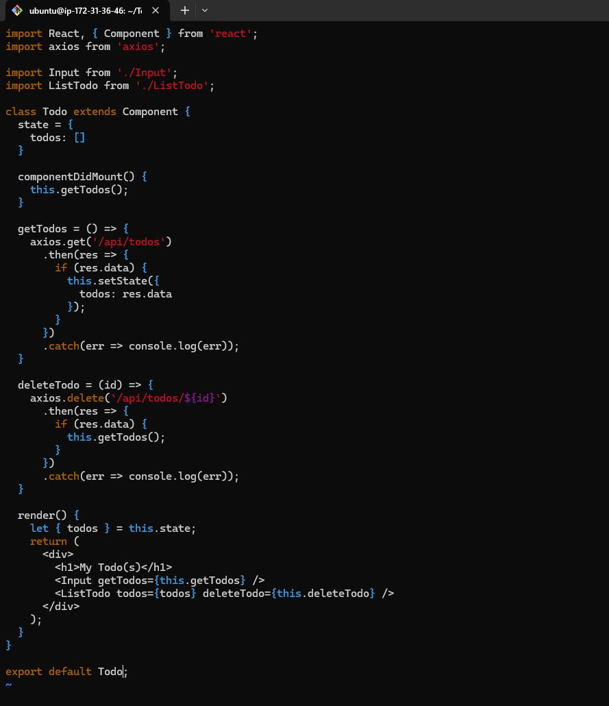

<h2><b>MERN STACK IMPLEMENTATION IN AWS</b></h2>

<h3><b>Introduction</b></h3>

The MERN stack is a collection of technologies that help developers build robust and scalable web applications using JavaScript. The acronym “MERN” stands for MongoDB, Express, React, and Node.js, with each component playing a role in the development process. MongoDB serves as a document-oriented database that can efficiently store data in JSON format. Express is a web application framework that provides a set of features to streamline the assembly of web applications. React is a front-end JavaScript library that offers a large toolkit for crafting user interfaces. Node.js is the runtime environment for execution of JavaScript code on the server side, coordinating communication between front-end and back-end components.

<h3><b>Prerequisites</b></h3>
<ol><li> An AWS account with appropriate permissions to create and manage EC2 instances, Security Groups, and Key Pairs. </li>

<li>Basic familiarity with AWS services and the Linux command line interface.</ol></li>

<h3><b>Step 0 : Set up EC2 Instance</b></h3>

#### 1. Lunch EC2 instance type of t3.micro and Ubuntu 24.04 LTS (HVM) AMI type in eu-north-1 region.


#### 2. Create ssh key to access the EC2 server for secure access to the EC2 instance.
#### 3. Configure network security group to allow traffic on port 80 for HTTP connection, port 443 for HTTPS connectiona nd port 22 for SSH connection to the EC2 server.

#### 4. Conect to EC2 Instance via SSH
Before connecting to the instance, chnage the permission for the downloaded ssh key  to ensure your key is not publicly viewable with the command below:

```bash
sudo chmod 400 <private-key-name>.pem
```

After chnaging the permission, connect to the instance with the command below:

```bash
ssh -i "<private-key-name>.pem" ubuntu@<ip-address or dns-name>
```


<h3><b>Step 1 : Backend Configuration</b></h3>

#### 1. Update and Upgrade the packages on the EC2 server

```bash
sudo apt update
sudo apt upgrade -y
```

 


#### 2. Fetch location of Node.js software from Ubuntu repositories

```bash
curl -fsSL https://deb.nodesource.com/setup_18.x | sudo -E bash -
```



#### 3. Install Node.js 

```bash
sudo apt-get install nodejs -y
```

The command above installs both nodejs and npm. NPM is a package manager for node like apt for Ubuntu. It is used to install Node modules, packages and to manage dependency conflicts.


#### 4. Verify the node npm  installation

```bash
node -v

npm -v
```


<h3><b>Step 2 : Application Code Setup</b></h3>

#### 1. Create a new diretory for TO-DO Application project

```bash
mkdir Todo
```

#### 2. Run the command below to verify that To-DO directory is created

```bash
ls
```

#### 3. Change your current directory to newly created one in step 2.

```bash
cd Todo
```
#### 4. Initialise the Todo project.
Use the new npm init command to initalise te Todo project, so that a new file named package.json will be created.This file will normally contain information about your appliaction and the dependencies that it needs to run. Follow thw prompts after running the command. You can press Enter several times to accept defaults values, then accept to write out the package.json file by typing yes.

```bash
npm init
```
After that run ls command to confirm the package.json file is created

```bash
ls
```


<h3><b>Step 3 : SetUp ExpressJS</b></h3>

#### 1. Install ExpressJS with npm package manager

```bash
npm install express -y
```


#### 2. Create a file index.js and run ls to confirm the file is created successfully

```bash
touch index.js

ls
```


#### 3. Install the dotenv module

```bash
npm install dotenv -y
```


#### 4. Open the file index.js and paste the code below

```bash
const express = require('express');
require('dotenv').config();

const app = express();

const port = process.env.PORT || 5000;

app.use((req, res, next) => {
res.header("Access-Control-Allow-Origin", "\*");
res.header("Access-Control-Allow-Headers", "Origin, X-Requested-With, Content-Type, Accept");
next();
});

app.use((req, res, next) => {
res.send('Welcome to Express');
});

app.listen(port, () => {
console.log(`Server running on port ${port}`)
});

```


#### 5. Test the server if it is working by running the command below. if everything is fine, you should see Server running on port 5000 in the terminal

```bash
node index.js
```

#### 6. To open the page on the web browser, we need to open port 5000 on the EC2 security group on AWS console. After then use the command below to access the page on the web browser


```bash
http://<ip-address>:5000
```


#### 7. Set up Routes
There are 3 ations the Todo Application needs to do

* Create a new task
* Display list of all tasks
* Delete a completed task

Each task will be associated with sokme particular endpoint and will use different standard HTTP request methods: POST, GET, DELETE

For each task, we need to create routes that will define various endpoints that the Todo app will depen on. So let us create a folder routes and change wokring directory to the folder.

```bash
mkdir routes

cd routes
```

#### 8. Create a file api.js

```bash
touch api.js
```
And copy the code below into the file

```bash

const express = require ('express');
const router = express.Router();

router.get('/todos', (req, res, next) => {
});

router.post('/todos', (req, res, next) => {    
});

router.delete('/todos/:id', (req, res, next) => {
})

module.exports = router;
```
<h3><b>Step 4 : SetUp a Model</b></h3>

Since the app is going to make useof
Mongodb which is a NoSQL database, we need to create a model. A model is at the heart of JavaScript based applications, and it is whatmakes it interactive. We will also use models to define the database schema . This is importantso that we will be able to define the fields stored in each Mongodb document. We will also use models to define the database schema . This is importantso that we will be able to define the fields stored in each Mongodbdocument

#### 1. Change directory back to Todo folder and install Mongoose

```bash
cd ...
```

```bash
npm install mongoose
```


#### 2. Create a folder models and change working directory to the folder

```bash
mkdir models

cd models
```

#### 3. Create a file todo.js in the models folder and paste the code below in the file

```bash
touch todo.js
```

```bash
const mongoose = require('mongoose');
const Schema = mongoose.Schema;

//create schema for todo
const TodoSchema = new Schema({
action: {
type: String,
required: [true, 'The todo text field is required']
}
})

//create model for todo
const Todo = mongoose.model('todo', TodoSchema);

module.exports = Todo;
```

#### 4. Update the routes from the api.js in routes directory to make use of the new model. In the routes directory, open api.js and delete the code inside the file and paste the new code below

```bash
const express = require ('express');
const router = express.Router();
const Todo = require('../models/todo');

router.get('/todos', (req, res, next) => {

//this will return all the data, exposing only the id and action field to the client

Todo.find({}, 'action')
.then(data => res.json(data))
.catch(next)
});

router.post('/todos', (req, res, next) => {
if(req.body.action){
Todo.create(req.body)
.then(data => res.json(data))
.catch(next)
}else {
res.json({
error: "The input field is empty"
})
}
});

router.delete('/todos/:id', (req, res, next) => {
Todo.findOneAndDelete({"_id": req.params.id})
.then(data => res.json(data))
res.json(data)
.catch(next)
});

module.exports = router;
```


<h3><b>Step 5 : SetUp MongoDB Database</b></h3>

We need a database where we will store our data. For this we will make useof
mLab. mLab provides MongoDB database as a service solution (
DBaaS), so to make life easy, you will need to sign up for a shared clusters freeaccount, which is ideal for our use case. Follow the sign up process, select
AWS as the cloud provider, and choose a region near you. Allow access to the MongoDB database from anywhere (Not secure, but itis ideal for testing)

#### 1. Create a file in the Todo directory and name it .env

```bash
touch .env
```

Add the connection string to access the database in it, just as below:

```bash
DB = 'mongodb+srv://<username>:<password>@<network-address>/<dbname>?retryWrites=true&w=majority'
```
#### 2. Update the index.js file o reflect the use of .env so the Node.js can connect to the database. replace the code in index.js file with the code below:

```bash

const express = require('express');
const bodyParser = require('body-parser');
const mongoose = require('mongoose');
const routes = require('./routes/api');
const path = require('path');
require('dotenv').config();

const app = express();
const port = process.env.PORT || 5000;

//connect to the database
mongoose.connect(process.env.DB, { useNewUrlParser: true,
useUnifiedTopology: true })
.then(() => console.log('Database connected successfully'))
.catch(err => console.log(err));

//since mongoose promise is depreciated, we overide it with node's promise
mongoose.Promise = global.Promise;

app.use((req, res, next) => {
res.header("Access-Control-Allow-Origin", "\*");
res.header("Access-Control-Allow-Headers", "Origin, X-Requested-With, Content-Type, Accept");
next();
});

app.use(bodyParser.json());

app.use('/api', routes);

app.use((err, req, res, next) => {
console.log(err);
next();
});

app.listen(port, () => {
console.log(`Server running on port ${port}`)
});

```
#### 3. Start the server using the command below:

```bash
node index.js
```


<h3><b>Step 6 : Testing Backend Code without Frontend using RESTful API</b></h3>

So far we have written backend part of our
To-Do application, andconfigured a database, but we do not have a frontend UI yet. We needReactJS code to achieve that. But during development, we will need a wayto test our code using RESTfulL API. Therefore, we will need to make use ofsome API development client to test our code. In this project, we will use
Postman to test our API. You should test all the API endpoints and make sure they are working. Forthe endpoints that require body, you should send JSON back with thenecessary fields since it’s what we setup in our code.

#### 1. Make a GET request on postman using the command below. Thsi request retrieves all existing records from the To-do applictaion.

```bash
http://<ip-address>/api/todos
```

After make the request, an empty collection will return since there is no data in the database.


#### 2. Make a POST requests. This request post all tasks to the to-do application


After the request check the database collection on mongodb console


#### 2. Make a DELETE requests. Thsi request will delete task on the to-do application.


<h3><b>Step 7 : Frontend Creation</b></h3>

Since we are done with the functionality we want from our backend andAPI, it is time to create a user interface for a Web client (browser) tointeract with the application via API. To start out with the frontend of the To-do app, 
we will use the create-react-app command to scaffold our app.

#### 1. Create the frontend app
In the same root directory as your backend code, which is the Todo directory, run:

```bash
npx create-react-app client
```


Running a React App

Before testing the react app, there are some dependencies that need to beinstalled.

#### 2. Install concurrently. it is used to run more than one command simultaneously from the same terrminal window

```bash
npm install concurrently --save-dev
```


#### 3. Install nodemon. it is used to run and monitor the server. If there is any change in the server code, nodemon will restart it automatically and load the new chnages.

```bash
npm install nodemon --save-dev
```


#### 4. In Todo folder open the package.json file. Change the highlighted part of the below screenshot and replace with the code below.

```bash
"scripts": {
"start": "node index.js",
"start-watch": "nodemon index.js",
"dev": "concurrently \"npm run start-watch\" \"cd client && npm start\""
}

```


#### 5.Change directory to 'client', open the package.json file and add the below key value pair

```bash
"proxy":"http://localhost:5000"
```


The whole purpose of adding the proxy configuration in number 3 above isto make it possible to access the application directly from the browser bysimply calling the server url like http://localhost:5000 rather than alwaysincluding the entire path like http://localhost:5000/api/todos.

#### 6.Change back to the Todo directory and run the command below:

```bash
npm run dev
```


Your app should open and start running on
localhost:3000 Important note: In order to be able to access the application from theInternet you have to open TCP port 3000 on EC2 by adding a new SecurityGroup rule. You already know how to do it.


<h3><b>Step 8 : Creating your React Components</b></h3>

One of the advantages of react is that it makes use of components, whichare reusable and also makes code modular. For our Todo app, there will betwo stateful components and one stateless component.

#### 1. From the Todo directory, move to the client directory and move to src

```bash
cd client/src
```

#### 2. Inside the src folder create a folder called components and move into the folder

```bash
mkdir components
cd components
```

#### 3. Inside 'components' directory create threefiles Input.js, ListTodo.js and Todo.js.

```bash
touch Input.js ListTodo.js Todo.js
```

#### 4. Open Input.js file and paste the code below:


```bash
vi Input.js
```
```bash

import React, { Component } from 'react';
import axios from 'axios';

class Input extends Component {
  state = {
    action: ""
  }

  handleChange = (event) => {
    this.setState({ action: event.target.value });
  }

  addTodo = () => {
    const task = { action: this.state.action };

    if (task.action && task.action.length > 0) {
      axios.post('/api/todos', task)
        .then(res => {
          if (res.data) {
            this.props.getTodos();
            this.setState({ action: "" });
          }
        })
        .catch(err => console.log(err));
    } else {
      console.log('Input field required');
    }
  }

  render() {
    let { action } = this.state;
    return (
      <div>
        <input type="text" onChange={this.handleChange} value={action} />
        <button onClick={this.addTodo}>add todo</button>
      </div>
    );
  }
}

export default Input;

```


#### 5. To make use of Axios, which is a Promise based HTTP client for the browserand node.js, you need to cd into your client from your terminal and runyarn add axios or npm install axios.

```bash
cd ../..
```

```bash
npm install axios
```


#### 6. Navigate back to the components folder in src and paste the code below into ListTodo.js file.

```bash
cd src/components
```

```bash

import React from 'react';

const ListTodo = ({ todos, deleteTodo }) => {
  return (
    <ul>
      {
        todos && todos.length > 0 ? (
          todos.map(todo => {
            return (
              <li key={todo._id} onClick={() => deleteTodo(todo._id)}>
                {todo.action}
              </li>
            );
          })
        ) : (
          <li>No todo(s) left</li>
        )
      }
    </ul>
  );
}

export default ListTodo;

```


#### 7. In the Todo.js file past the code below

```bash

import React, { Component } from 'react';
import axios from 'axios';

import Input from './Input';
import ListTodo from './ListTodo';

class Todo extends Component {
  state = {
    todos: []
  }

  componentDidMount() {
    this.getTodos();
  }

  getTodos = () => {
    axios.get('/api/todos')
      .then(res => {
        if (res.data) {
          this.setState({
            todos: res.data
          });
        }
      })
      .catch(err => console.log(err));
  }

  deleteTodo = (id) => {
    axios.delete(`/api/todos/${id}`)
      .then(res => {
        if (res.data) {
          this.getTodos();
        }
      })
      .catch(err => console.log(err));
  }

  render() {
    let { todos } = this.state;
    return (
      <div>
        <h1>My Todo(s)</h1>
        <Input getTodos={this.getTodos} />
        <ListTodo todos={todos} deleteTodo={this.deleteTodo} />
      </div>
    );
  }
}

export default Todo;

```



We need to make little adjustment to our react code. Delete the logo andadjust our App.js to look like this.

#### 8. Navigate back to the src folder. Copy and paste the code below into App.js file

```bash
cd ..
```

```bash

import React from 'react';
import Todo from './components/Todo';
import './App.css';

const App = () => {
  return (
    <div className="App">
      <Todo />
    </div>
  );
}

export default App;


```


#### 9. In the src directory open the App.css. Then paste the following code into App.css:

```bash
vi App.css
```

```bash

.App {
  text-align: center;
  font-size: calc(10px + 2vmin);
  width: 60%;
  margin-left: auto;
  margin-right: auto;
}

input {
  height: 40px;
  width: 50%;
  border: none;
  border-bottom: 2px #101113 solid;
  background: none;
  font-size: 1.5rem;
  color: #787a80;
}

input:focus {
  outline: none;
}

button {
  width: 25%;
  height: 45px;
  border: none;
  margin-left: 10px;
  font-size: 25px;
  background: #101113;
  border-radius: 5px;
  color: #787a80;
  cursor: pointer;
}

button:focus {
  outline: none;
}

ul {
  list-style: none;
  text-align: left;
  padding: 15px;
  background: #171a1f;
  border-radius: 5px;
}

li {
  padding: 15px;
  font-size: 1.5rem;
  margin-bottom: 15px;
  background: #282c34;
  border-radius: 5px;
  overflow-wrap: break-word;
  cursor: pointer;
}

@media only screen and (min-width: 300px) {
  .App {
    width: 80%;
  }

  input {
    width: 100%;
  }

  button {
    width: 100%;
    margin-top: 15px;
    margin-left: 0;
  }
}

@media only screen and (min-width: 640px) {
  .App {
    width: 60%;
  }

  input {
    width: 50%;
  }

  button {
    width: 30%;
    margin-left: 10px;
    margin-top: 0;
  }
}

```


#### 10. In the src directory open the index.css. Then paste the following code into index.css:

```bash
vi index.css
```

```bash

body {
  margin: 0;
  padding: 0;
  font-family: -apple-system, BlinkMacSystemFont, "Segoe UI", "Roboto", "Oxygen", "Ubuntu", "Cantarell", "Fira Sans", "Droid Sans", "Helvetica Neue", sans-serif;
  -webkit-font-smoothing: antialiased;
  -moz-osx-font-smoothing: grayscale;
  box-sizing: border-box;
  background-color: #282c34;
  color: #787a80;
}

code {
  font-family: source-code-pro, Menlo, Monaco, Consolas, "Courier New", monospace;
}

```


#### 11. Navigate back to the todo directory

```bash
cd ../..
```

#### 12. Start the server by runnig the command below

```bash
npm run dev
```


#### 13. Open the Todo appliaction on web browser

```bash
http://<ip-address>:3000
```

