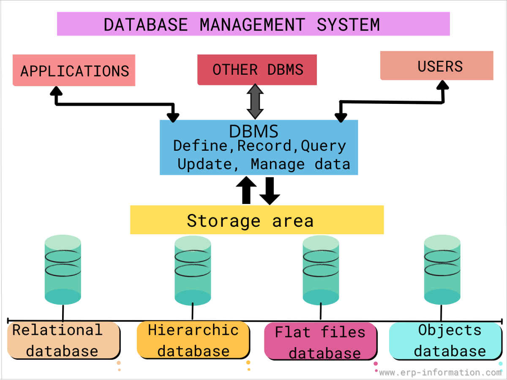

<h2><b>DATABASE MANAGEMENT SYSTEM (DBMS)</b></h2>

<h3><b>Introduction</b></h3>

A database management system (DBMS) is system software for creating and managing databases. A DBMS makes it possible for end users to create, protect, read, update and delete data in a database. The most prevalent type of data management platform, the DBMS essentially serves as an interface between databases and users or application programs, ensuring that data is consistently organized and remains easily accessible. The DBMS manages the data; the database engine allows data to be accessed, locked and modified; and the database schema defines the database's logical structure. These three foundational elements help provide concurrency, security, data integrity and uniform data administration procedures. The DBMS supports many typical database administration tasks, including change management, performance monitoring and tuning, security, and backup and recovery. Most database management systems are also responsible for automated rollbacks and restarts as well as logging and auditing of activity in databases and the applications that access them. In a relational database management system (RDBMS) -- the most widely used type of DBMS -- the API is SQL, a standard programming language for defining, protecting and accessing data.

<h3><b>Components of DBMS</b></h3>

A DBMS is a sophisticated piece of system software consisting of multiple integrated components that deliver a consistent, managed environment for creating, accessing and modifying data in databases. These components include the following:

<h4>1. Storage Engine</h4>
This basic element of a DBMS is used to store data. The DBMS must interface with a file system at the operating system (OS) level to store data. It can use additional components to store data or interface with the actual data at the file system level.

<h4>2. Metadata Catalog</h4>
 Sometimes called a system catalog or database dictionary, a metadata catalog functions as a repository for all the database objects that have been created. When databases and other objects are created, the DBMS automatically registers information about them in the metadata catalog. The DBMS uses this catalog to verify user requests for data, and users can query the catalog for information about the database structures that exist in the DBMS. The metadata catalog can include information about database objects, schemas, programs, security, performance, communication and other environmental details about the databases it manages.

 <h4>3. Database Access Language</h4>
 The DBMS also must provide an API to access the data, typically in the form of a database access language to access and modify data but may also be used to create database objects and secure and authorize access to the data. SQL is an example of a database access language and encompasses several sets of commands, including Data Control Language for authorizing data access, Data Definition Language for defining database structures and Data Manipulation Language for reading and modifying data.

<h4>4. Optimization engine</h4>
A DBMS may also provide an optimization engine, which is used to parse database access language requests and turn them into actionable commands for accessing and modifying data.

<h4>5. Query processor</h4>
After a query is optimized, the DBMS must provide a means for running the query and returning the results.

<h4>6. Lock Manager</h4>
This crucial component of the DBMS manages concurrent access to the same data. Locks are required to ensure multiple users aren't trying to modify the same data simultaneously.

<h4>7. Log Manager</h4> 
The DBMS records all changes made to data managed by the DBMS. The record of changes is known as the log, and the log manager component of the DBMS is used to ensure that log records are made efficiently and accurately. The DBMS uses the log manager during shutdown and startup to ensure data integrity, and it interfaces with database utilities to create backups and run recoveries.

<h4>8. Data Utilities</h4>
A DBMS also provides a set of utilities for managing and controlling database activities. Examples of database utilities include reorganization, runstats, backup and copy, recover, integrity check, load data, unload data and repair database.

<h3><b>Types of DBMS</b></h3>

<h4>1. Relational Database Management System (RDBMS)</h4>
 Sometimes referred to as a SQL DBMS and adaptable to most use cases, RDBMS presents data as rows in tables with a fixed schema and relationships defined by values in key columns. RDBMS Tier-1 products can be quite expensive, but there are high quality, open source options such as PostgreSQL that can be cost-effective. Other examples of popular RDBMS products include Oracle, MySQL, Microsoft SQL Server and IBM Db2.

 <h4>2. NoSQL DBMS</h4>
 Well-suited for loosely defined data structures that may evolve over time, NoSQL DBMS may require more application involvement for schema management. There are four types of NoSQL database systems: document databases, graph databases, key-value stores and wide-column stores. Each uses a different type of data model, resulting in significant differences between each NoSQL type.

<ul><li>Document databases store semi-structured data and descriptions of that data in document format, usually JavaScript Object Notation (JSON). They're useful for flexible schema requirements such as those common with content management and mobile applications. Popular document databases include MongoDB and Couchbase.</li>

<li>Graph databases organize data as nodes and relationships instead of tables or documents. Because it stores the relationship between nodes, the graph system can support richer representations of data relationships. The graph data model doesn't rely on a strict schema, and it can evolve over time. Graph databases are useful for applications that map relationships, such as social media platforms, reservation systems or customer relationship management. Examples of popular graph databases include Neo4j and GraphDB.</li>

<li>Key-value stores are based on a simple data model that pairs a unique key with an associated value. Due to this simplicity, key-value stores can be used to develop highly scalable and performant applications such as those for session management and caching in web applications or for managing shopping cart details for online buyers. Examples of popular key-value databases include Redis and Memcached.</li>

<li>Wide-column stores use the familiar tables, columns and rows of relational database systems, but column names and formatting can differ from row to row in a single table. Each column is also stored separately on disk. As opposed to traditional row-orientated storage, a wide-column store is optimal when querying data by columns, such as in recommendation engines, catalogs, fraud detection and event logging. Cassandra and HBase are examples of wide-column stores.</li></ul>

<h4>3. NewSQL DBMS</h4>
 Modern relational systems that use SQL, NewSQL database systems offer the same scalable performance as NoSQL systems. But NewSQL systems also provide ACID (atomicity, consistency, isolation and durability) support for data consistency. A NewSQL DBMS is engineered as a relational, SQL database system with a distributed, fault-tolerant architecture. Other typical features of NewSQL system offerings include in-memory capability and clustered database services with the ability to be deployed in the cloud. Many NewSQL DBMS packages have fewer features and components and a smaller footprint than legacy relational offerings, making them easier to support and understand. Some vendors now eschew the NewSQL label and describe their technologies as distributed SQL databases. CockroachDB, Google Cloud Spanner, NuoDB, Volt Active Data and YugabyteDB are examples of database systems in this category.

<h4>4. In-Memeory DBMS</h4>
An in-memory database management system predominantly relies on main memory for data storage, management and manipulation. By reducing the latency associated with reading from disk, an IMDBMS can provide faster response times and better performance but can consume more resources. Therefore, an in-memory database is ideal for applications that require high performance and rapid access to data, such as data stores that support real-time HTAP (hybrid transactional and analytical process). Any type of DBMS (relational, NoSQL, etc.) can also support in-memory processing. SAP HANA and Redis are examples of in-memory database systems.

<h4>5. Columnar DBMS</h4>

A columnar database management system stores data in tables focused on columns instead of rows, resulting in more efficient data access when only a subset of columns is required. It's well-suited for data warehouses that have a large number of similar data items. Popular columnar database products include Snowflake and Amazon Redshift.

<h4>6. Multimodel DBMS</h4>

This system supports more than one database model. Users can choose the model most appropriate for their application requirements without having to switch to a different DBMS. For example, IBM Db2 is a relational DBMS, but it also offers a columnar option. Many of the most popular database systems similarly qualify as multimodel through add-ons, including Oracle, PostgreSQL and MongoDB. Other products, such as Azure Cosmos DB and MarkLogic, were developed specifically as multimodel databases.

<h6>Reference</h6>

1. https://forum.huawei.com/enterprise/en/What-is-database-management-system/thread/667282450692325376-667213860102352896

2. https://www.techtarget.com/searchdatamanagement/definition/database-management-system
