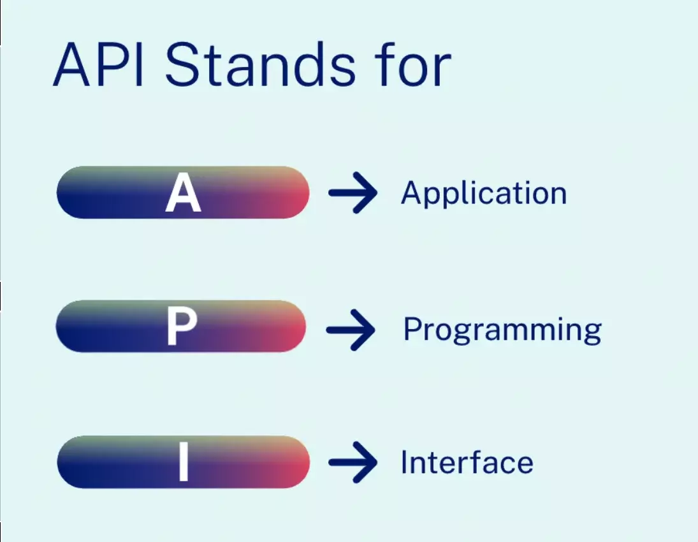

<h2><b>RESTFUL API</b></h2>

<h3><b>Introduction</b></h3>

An application programming interface (API) defines the rules that you must follow to communicate with other software systems. Developers expose or create APIs so that other applications can communicate with their applications programmatically. For example, the timesheet application exposes an API that asks for an employee's full name and a range of dates. When it receives this information, it internally processes the employee's timesheet and returns the number of hours worked in that date range. You can think of a web API as a gateway between clients and resources on the web.

<ul><li><b>Clients</b> : Clients are users who want to access information from the web. The client can be a person or a software system that uses the API. For example, developers can write programs that access weather data from a weather system. Or you can access the same data from your browser when you visit the weather website directly.</li>

<li><b>Resources</b> : Resources are the information that different applications provide to their clients. Resources can be images, videos, text, numbers, or any type of data. The machine that gives the resource to the client is also called the server. Organizations use APIs to share resources and provide web services while maintaining security, control, and authentication. In addition, APIs help them to determine which clients get access to specific internal resources.</li></ul>

<h3><b>What is REST?</b></h3>
Representational State Transfer (REST) is a software architecture that imposes conditions on how an API should work. REST was initially created as a guideline to manage communication on a complex network like the internet. You can use REST-based architecture to support high-performing and reliable communication at scale. You can easily implement and modify it, bringing visibility and cross-platform portability to any API system.   API developers can design APIs using several different architectures. APIs that follow the REST architectural style are called REST APIs. Web services that implement REST architecture are called RESTful web services. The term RESTful API generally refers to RESTful web APIs. However, you can use the terms REST API and RESTful API interchangeably.

<h3><b>Principles of REST Architecture Style</b></h3>

<h4>1. Uniform interface</h4>
The uniform interface is fundamental to the design of any RESTful webservice. It indicates that the server transfers information in a standard format. The formatted resource is called a representation in REST. This format can be different from the internal representation of the resource on the server application. For example, the server can store data as text but send it in an HTML representation format.

Uniform interface imposes four architectural constraints:

1. Requests should identify resources. They do so by using a uniform resource identifier.
2. Clients have enough information in the resource representation to modify or delete the resource if they want to. The server meets this condition by sending metadata that describes the resource further.
3. Clients receive information about how to process the representation further. The server achieves this by sending self-descriptive messages that contain metadata about how the client can best use them.
4. Clients receive information about all other related resources they need to complete a task. The server achieves this by sending hyperlinks in the representation so that clients can dynamically discover more resources.

<h4>2. Statelessness</h4>
In REST architecture, statelessness refers to a communication method in which the server completes every client request independently of all previous requests. Clients can request resources in any order, and every request is stateless or isolated from other requests. This REST API design constraint implies that the server can completely understand and fulfill the request every time. 

<h4>3. Layered system</h4>
In a layered system architecture, the client can connect to other authorized intermediaries between the client and server, and it will still receive responses from the server. Servers can also pass on requests to other servers. You can design your RESTful web service to run on several servers with multiple layers such as security, application, and business logic, working together to fulfill client requests. These layers remain invisible to the client.

<h4>4. Cacheability</h4>
RESTful web services support caching, which is the process of storing some responses on the client or on an intermediary to improve server response time. For example, suppose that you visit a website that has common header and footer images on every page. Every time you visit a new website page, the server must resend the same images. To avoid this, the client caches or stores these images after the first response and then uses the images directly from the cache. RESTful web services control caching by using API responses that define themselves as cacheable or noncacheable.

<h4>5. Code on demand</h4>
In REST architectural style, servers can temporarily extend or customize client functionality by transferring software programming code to the client. For example, when you fill a registration form on any website, your browser immediately highlights any mistakes you make, such as incorrect phone numbers. It can do this because of the code sent by the server.

<h3><b>Components REST API Request</b></h3>

RESTful APIs require requests to contain the following main components:

<h4>1. Unique resource identifier</h4>
The server identifies each resource with unique resource identifiers. For REST services, the server typically performs resource identification by using a Uniform Resource Locator (URL). The URL specifies the path to the resource. A URL is similar to the website address that you enter into your browser to visit any webpage. The URL is also called the request endpoint and clearly specifies to the server what the client requires.

<h4>2. Method</h4>
Developers often implement RESTful APIs by using the Hypertext Transfer Protocol (HTTP). An HTTP method tells the server what it needs to do to the resource. The following are four common HTTP methods:

<ul><li>GET

Clients use GET to access resources that are located at the specified URL on the server. They can cache GET requests and send parameters in the RESTful API request to instruct the server to filter data before sending.</li>

<li>POST

Clients use POST to send data to the server. They include the data representation with the request. Sending the same POST request multiple times has the side effect of creating the same resource multiple times. </li>

<li>DELETE

Clients use the DELETE request to remove the resource. A DELETE request can change the server state. However, if the user does not have appropriate authentication, the request fails.
</li>

</ul>
<h4>3. HTTP headers</h4>
Request headers are the metadata exchanged between the client and server. For instance, the request header indicates the format of the request and response, provides information about request status, and so on.

<h4>4. Data</h4>
REST API requests might include data for the POST, PUT, and other HTTP methods to work successfully.

<h4>5. Parameters</h4>
RESTful API requests can include parameters that give the server more details about what needs to be done. The following are some different types of parameters:

* Path parameters that specify URL details.
* Query parameters that request more information about the resource.
* Cookie parameters that authenticate clients quickly.

<h3><b>RESTful API authentication methods</b></h3>
A RESTful web service must authenticate requests before it can send a response. Authentication is the process of verifying an identity. For example, you can prove your identity by showing an ID card or driver's license. Similarly, RESTful service clients must prove their identity to the server to establish trust.

RESTful API has four common authentication methods:

<h4>1. HTTP authentication</h4>
HTTP defines some authentication schemes that you can use directly when you are implementing REST API. The following are two of these schemes:

<ol><li> Basic authentication

In basic authentication, the client sends the user name and password in the request header. It encodes them with base64, which is an encoding technique that converts the pair into a set of 64 characters for safe transmission.</li>

<li>Bearer authentication

The term bearer authentication refers to the process of giving access control to the token bearer. The bearer token is typically an encrypted string of characters that the server generates in response to a login request. The client sends the token in the request headers to access resources.</li></ol>

<h4>2. API keys</h4>
API keys are another option for REST API authentication. In this approach, the server assigns a unique generated value to a first-time client. Whenever the client tries to access resources, it uses the unique API key to verify itself. API keys are less secure because the client has to transmit the key, which makes it vulnerable to network theft.

<h4>3. OAuth</h4>
OAuth combines passwords and tokens for highly secure login access to any system. The server first requests a password and then asks for an additional token to complete the authorization process. It can check the token at any time and also over time with a specific scope and longevity.

<h6>Reference</h6>

1. https://aws.amazon.com/what-is/restful-api/#:~:text=RESTful%20API%20is%20an%20interface,applications%20to%20perform%20various%20tasks.
