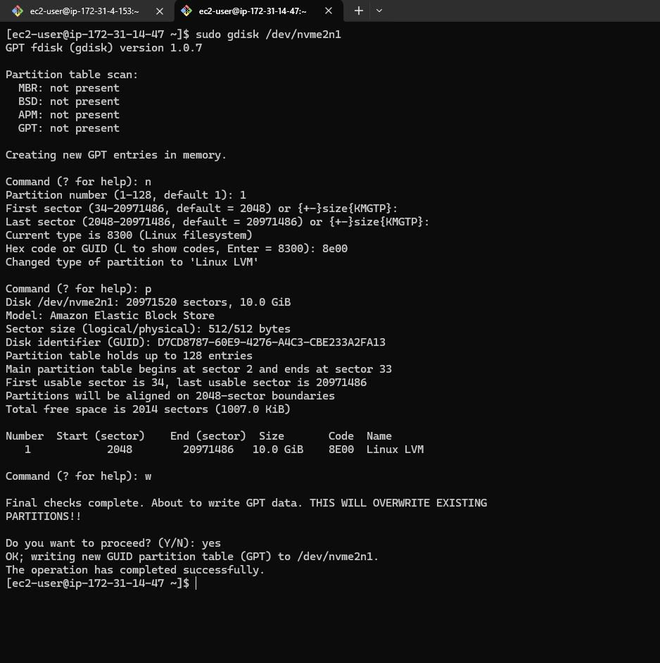
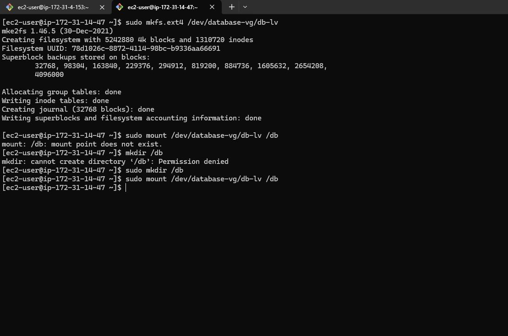
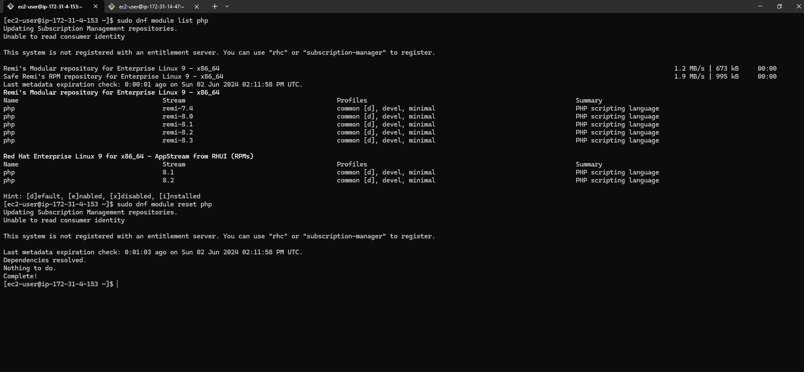

<h2><b>WEB SOLUTION WITH WORDPRESS</b></h2>

<h3><b>Prerequisites</b></h3>
<ol><li> An AWS account with appropriate permissions to create and manage EC2 instances, Security Groups, and Key Pairs. </li>

<li>Basic familiarity with AWS services and the Linux command line interface.</ol></li>

<h3><b>Step 1 : Prepare a Web Server</b></h3>

#### 1. Launch a RedHat EC2 instance that will serve as "Web Server". Create 3 volumes in the same AZ as your Web Server EC2, each of 10 GiB.


#### 2. Connect to Instances via SSH
Before connecting to the instance, change the permission for the downloaded ssh key  to ensure your key is not publicly viewable with the command below:

```bash
sudo chmod 400 <private-key-name>.pem
```

After changing the permission, connect to the instance with the command below:

```bash
ssh -i "<private-key-name>.pem" user@<ip-address or dns-name>
```


#### 3. Use lsblk command to inspect what block devices are attached to theserver. Notice names of your newly created devices. All devices inLinux reside in /dev/ directory. Inspect it with ls /dev/ and make sureyou see all 3 newly created block devices there - their names will likely be xvdf, xvdh, xvdg.

```bash
lsblk
```


#### 4. Use df -h command to see all mounts and free space on your server


#### 5. Use gdisk utility to create a single partition on each of the 3 disks

```bash
sudo gdisk /dev/nvme1n1
```


```bash
sudo gdisk /dev/nvme2n1
```


```bash
sudo gdisk /dev/nvme3n1
```


#### 6. Use lsblk utility to view the newly configured partition on each of the 3disks.

```bash
lsblk
```


#### 7. Install lvm2 package using sudo yum install lvm2.

```bash
sudo yum install lvm2 -y
```


#### 8. Use pvcreate utility to mark each of 3 disks as physical volumes (PVs) tobe used by LVM. Verify that your Physical volume has been created successfully byrunning sudo pvs

```bash
sudo pvcreate /dev/nvme1n1p1 /dev/nvme2n1p1 /dev/nvme3n1p1
```

```bash
sudo pvs
```


#### 9. Use vgcreate utility to add all 3 PVs to a volume group (VG). Name the VG webdata-vg. Verify that your VG has been created successfully by running sudo vgs.

```bash
sudo vgcreate webdata-vg /dev/nvme1n1p1 /dev/nvme2n1p1 /dev/nvme3n1p1
```

```bash
sudo vgs
```


#### 10. Use lvcreate utility to create 2 logical volumes.apps-lv (Use half of thePV size), and logs-lv Use the remaining space of the PV size. NOTE :apps-lv will be used to store data for the Website while, logs-lv will beused to store data for logs.

```bash
sudo lvcreate -n apps-lv -L 14G webdata-vg

sudo lvcreate -n logs-lv -L 14G webdata-vg

sudo lvs
```


#### 11. Verify the entire setup

```bash
sudo vgdisplay -v   #view complete setup, VG, PV and LV
```


```bash
lsblk
```


#### 12. Use mkfs.ext4 to format the logical volumes with ext4 filesystem

```bash
sudo mkfs -t ext4 /dev/webdata-vg/apps-lv

sudo mkfs -t ext4 /dev/webdata-vg/logs-lv
```


#### 13. Create /var/www/html directory to store website files and /home/recovery/logs to store backup of log data.

```bash
sudo mkdir -p /var/www/html

sudo mkdir -p /home/recovery/logs
```
#### 14. Mount /var/www/html on apps-lv logical volume.

```bash
sudo mount /dev/webdata-vg/apps-lv /var/www/html
```


#### 15. Use rsync utility to backup all the files in the logdirectory /var/log into /home/recovery/logs ( This is required beforemounting the file system)

```bash
sudo rsync -av /var/log/ /home/recovery/logs/
```


#### 16. Mount /var/log on logs-lv logical volume.(
Note that all the existingdata on /var/log will be deleted. That is why step 15 above is veryimportant)

```bash
sudo mount /dev/webdata-vg/logs-lv /var/log
```
#### 17. Restore log files back into /var/log directory.

```bash
sudo rsync -av /home/recovery/logs/ /var/log
```


#### 18. Update /etc/fstab file so that the mount configuration will persist afterrestart of the server.
The UUID of the device will be used to update the /etc/fstab
file;

```bash
sudo blkid
```

```bash
UUID=b06bdfea-42f7-494a-bdb1-72bbecaf2c09 /var/www/html ext4 defaults 0 0

UUID=520ff700-1603-4a38-bc07-75be670b9a69 /var/log ext4 defaults 0 0
```

```bash
sudo vi /etc/fstab
```
Update /etc/fstab in this format using your own UUID and rememeber toremove the leading and ending quotes.


#### 19. Test the configuration and reload the daemon

```bash
sudo mount -a 
sudo systemctl daemon-reload
df -h   # Verifies the setup
```


<h3><b>Step 2 : Prepare a Web Server</b></h3>

#### 1. Launch another RedHat EC2 instance that will serve as "DB Server". Create 3 volumes in the same AZ as your Web Server EC2, each of 10 GiB.


#### 2. Connect to Instances via SSH
Before connecting to the instance, change the permission for the downloaded ssh key  to ensure your key is not publicly viewable with the command below:

```bash
sudo chmod 400 <private-key-name>.pem
```

After changing the permission, connect to the instance with the command below:

```bash
ssh -i "<private-key-name>.pem" user@<ip-address or dns-name>
```


#### 3. Use lsblk command to inspect what block devices are attached to theserver. Notice names of your newly created devices. All devices inLinux reside in /dev/ directory. Inspect it with ls /dev/ and make sureyou see all 3 newly created block devices there - their names will likely be xvdf, xvdh, xvdg.

```bash
lsblk
```


#### 4. Use df -h command to see all mounts and free space on your server

```bash
df -h
```


#### 5. Use gdisk utility to create a single partition on each of the 3 disks

```bash
sudo gdisk /dev/nvme1n1
```


```bash
sudo gdisk /dev/nvme2n1
```


```bash
sudo gdisk /dev/nvme3n1
```


#### 6. Use lsblk utility to view the newly configured partition on each of the 3disks.

```bash
lsblk
```


#### 7. Install lvm2 package using sudo yum install lvm2.

```bash
sudo yum install lvm2 -y
```


#### 8. Use pvcreate utility to mark each of 3 disks as physical volumes (PVs) tobe used by LVM. Verify that your Physical volume has been created successfully byrunning sudo pvs

```bash
sudo pvcreate /dev/nvme1n1p1 /dev/nvme2n1p1 /dev/nvme3n1p1
```

```bash
sudo pvs
```


#### 9. Use vgcreate utility to add all 3 PVs to a volume group (VG). Name the VG database-vg. Verify that your VG has been created successfully by running sudo vgs.

```bash
sudo vgcreate database-vg /dev/nvme1n1p1 /dev/nvme2n1p1 /dev/nvme3n1p1
```

```bash
sudo vgs
```


#### 10. Use lvcreate utility to create 2 logical volumes.apps-lv (Use half of thePV size), and logs-lv Use the remaining space of the PV size. NOTE :apps-lv will be used to store data for the Website while, logs-lv will beused to store data for logs.

```bash
sudo lvcreate -n db-lv -L 20G database-vg

sudo lvs
```


#### 11. Verify the entire setup

```bash
sudo vgdisplay -v   #view complete setup, VG, PV and LV
```


```bash
lsblk
```


#### 12. Use mkfs.ext4 to format the logical volumes with ext4 filesystem and monut /db on db-lv

```bash
sudo mkfs.ext4 /dev/database-vg/db-lv

sudo mount /dev/database-vg/db-lv /db
```


``

#### 13. Update /etc/fstab file so that the mount configuration will persist afterrestart of the server.
The UUID of the device will be used to update the /etc/fstab
file;

```bash
sudo blkid
```

```bash

UUID=78d1026c-8872-4114-98bc-b9336aa66691 /db ext4 defaults 0 0
```

```bash
sudo vi /etc/fstab
```
Update /etc/fstab in this format using your own UUID and rememeber toremove the leading and ending quotes.


#### 14. Test the configuration and reload the daemon

```bash
sudo mount -a 
sudo systemctl daemon-reload
df -h   # Verifies the setup
```


<h3><b>Step 3 : Install WordPress on your Web Server EC2</b></h3>

#### 1. Update the repository

```bash
sudo yum -y update
```

#### 2. Install wget, Apache and it's dependencies

```bash
sudo dnf install wget httpd php-json -y
```


#### 3.  Install the latest version of PHP and it's dependencies using the Remi repository.

Install the EPEL repository

The package manager dnf was used here. It generally offers better performance and more efficient dependency resolution. dnf is the modern, actively maintained package manager, while yum is older and gradually being phased out.

The system version of the RHEL EC2 is version "9"

```bash
sudo dnf install https://dl.fedoraproject.org/pub/epel/epel-release-latest-9.noarch.rpm
```


Install yum utils and enable remi-repository

```bash
sudo dnf install dnf-utils http://rpms.remirepo.net/enterprise/remi-release-9.rpm
```


After the successful installation of yum-utils and Remi-packages, search for the PHP modules which are available for download by running the command.

```bash
sudo dnf module list php
```


The output above indicates that if the currently installed version of PHP is PHP 8.1, there is need to install the newer release, PHP 8.2. Reset the PHP modules.

```bash
sudo dnf module reset php
```


Having run reset, enable the PHP 8.2 module by running

```bash
sudo dnf module enable php:remi-8.2
```

Install PHP, PHP-FPM (FastCGI Process Manager) and associated PHP modules using the command.

```bash
sudo dnf install php php-opcache php-gd php-curl php-mysqlnd -y
```


Verify the version installed to run.

```bash
php -v
```


Start, enable and check status of PHP-FPM on boot-up.

```bash
sudo systemctl start php-fpm
sudo systemctl enable php-fpm
sudo systemctl status php-fpm
```


#### 4. Configure SELinux Policies
To instruct SELinux to allow Apache to execute the PHP code via PHP-FPM run.

```bash

sudo chown -R apache:apache /var/www/html
sudo chcon -t httpd_sys_rw_content_t /var/www/html -R
sudo setsebool -P httpd_execmem 1
sudo setsebool -P httpd_can_network_connect=1
sudo setsebool -P httpd_can_network_connect_db=1

```


Restart Apache web server for PHP to work with Apache web server.

```bash
sudo systemctl restart httpd
```


Test to see the default Apache page on a browser using the public IP address

```bash
http://<ip-address>
```


#### 5. Download WordPress
Download wordpress and copy wordpress content to /var/www/html

```bash
sudo mkdir wordpress && cd wordpress
sudo wget http://wordpress.org/latest.tar.gz
sudo tar xzvf latest.tar.gz   # Extract wordpress
```


After extraction, cd into the extracted wordpress and Copy the content of wp-config-sample.php to wp-config.php.
This will copy and create the file wp-config.php

```bash
cd wordpress/
sudo cp -R wp-config-sample.php wp-config.php
```


Exit from the extracted wordpress. Copy the content of the extracted wordpress to /var/www/html.

```bash
cd ..
sudo cp -R wordpress/. /var/www/html/
```


<h3><b>Step 4 : Install MySQL on your DB Server EC2</b></h3>

#### 1. Update the EC2
```bash
sudo yum update -y
```

#### 2. Install MySQL Server

```bash
sudo yum install mysql-server -y
```


Verify that the service is up and running. If it is not running, restart the service and enable it so it will be running even after reboot.

```bash

sudo systemctl start mysqld
sudo systemctl enable mysqld
sudo systemctl status mysqld

```


#### 3. Configure DB to work with WordPress.

Run mysql secure script

```bash
sudo mysql_secure_installation
```


#### 4. Create database
The user "wordpress" will be connecting to the database using the Web Server private IP address

```bash

sudo mysql -u root -p

CREATE DATABASE wordpress_db;
CREATE USER 'wordpress'@'172.31.4.153' IDENTIFIED WITH mysql_native_password BY 'Admin.12345';
GRANT ALL PRIVILEGES ON wordpress_db.* TO 'wordpress'@'172.31.4.153' WITH GRANT OPTION;
FLUSH PRIVILEGES;
show databases;
exit

```


#### 5. Set the bind address

The bind address is set to the private IP address of the DB Server for more security instead of to any IP address (0.0.0.0)

```bash
sudo vi /etc/my.cnf
sudo systemctl restart mysqld
```


#### 6. Install mysql server on the Web Server EC2.
WordPress has its own database, therefore it needs a database server to store it's information such as: Username, Email, Passwords, First name and Last name of the users on the wordpress website on a database.

```bash
sudo yum install mysql-server
```


```bash
sudo systemctl start mysqld
sudo systemctl enable mysqld
sudo systemctl status mysqld
```


Open wp-config.php file and edit the database information

```bash
cd /var/www/html
sudo vi wp-config.php
sudo systemctl restart httpd
```


The private IP address of the DB Server is set as the DB_HOST because the DB Server and the Web Server resides in the same subnet which makes it possible for them to communicate directly. The private IP address is not an internet routable address.


Disable the Apache default page
Here the default page can be renamed.

```bash
sudo mv /etc/httpd/conf.d/welcome.conf /etc/httpd/conf.d/welcome.conf_backup
```

Connect to the DB Server from the Web Server

```bash

sudo mysql -h 172.31.14.47 -u wordpress -p

show databases;
exit;
```


Access the web page again with the Web Server public IP address and install wordpress on the browser


```bash
http://<ip-address>
```


Implementation of Web Solution with Wordpress is completed.